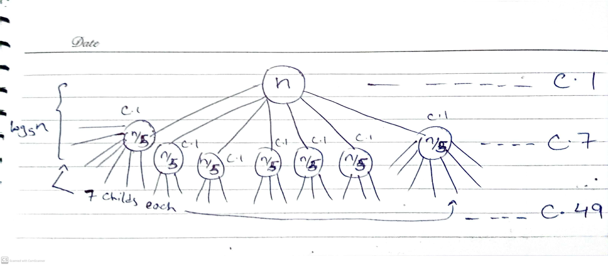

**​Reference Document: [HW1.pdf](assets/HW1-20230911192622-lysiogl.pdf)​**:

## Question 1

* Merge Sort = $32n\space lgn$

* Insertion Sort = $4n^2$

The values of n which can beat merge sort should satisfy the following inequality:

$$
4n^2 < 32\space nlogn
$$

$$
n^2 < 8\space nlogn
$$

$$
n < 8\space logn
$$

$$
\frac{n}{logn} < 8
$$

That is all values of **n < 43.5**

## Question 2

* Algo 1 = $100n^2$​

* Algo 2 = $2^n$

The smallest value of n that satisfies the following equation would be our answer:

$$
100 n^2 < 2^n
$$

$$
log\space100n^2 < n
$$

That is the smallest value of **14.4**

## Question 3

### (a)

```python
int s, i ,n; 			---- 1
cin >> n; 				---- 1
s = 0; 					---- 1
for(i=n; i>=1; i--)		---- n + 1
	s++;  				---- n * 1
```

Total = 1 + 1 + 1 + (n + 1) + n\
T(n)	= 2n + 4\
O(n)

* **T(n) <span>&lArr;</span> c f(n)**

  * $2n + 4 <= c n$
  * $2 + \frac{4}{n } <= c$

    * Let n = 1
    * 2 + 4 <span>&lArr;</span> c
    * 6 <span>&lArr;</span> c, therefore, c needs to be greater than or equal to 6 for every n >= 1
  * $2n + 4 <= 6n$

    * That is for n >= n<sub>0 </sub>where n<sub>0</sub> = 1
    * This condition satisfies for all values of n >= 1
  * Hence, we have proved that T(n) is O(n)

### (b)

```c++
int sum, i, j, n;        	------- 1 
sum = 0;					------- 1
cin >> n;					------- 1
for(i=1; i<n; i=i*2)		------- log2(n)
	for(j=1; j<n; j=j*2)	------- log2(n)-1 * log2(n)
		sum++;				-------	log2(n)-1 * log2(n)-1 * 1
```

Total = 1 + 1 + 1 + log(n) + log(n) \* (log(n) - 1) + (log(n) - 1) \* (log(n) - 1) \* 1\
\= 3 + log(n) + log(n)<sup>2 </sup>- log(n) + (log(n) - 1)<sup>2</sup>\
\= 3 + log(n)<sup>2 </sup>+ log(n)<sup>2</sup> + 1 - 2log(n)\
T(n)  = 4 + 2\*log(n)<sup>2</sup> - 2log(n)\
O(log(n)<sup>2</sup>)

* **T(n) <span>&lArr;</span> c f(n)**

  * 4 + 2log<sup>2</sup>(n) -2log(n) <span>&lArr;</span> c log<sub><sup>2</sup></sub>(n)
  * $\frac{4}{log^2n} + 2 - \frac{2}{logn} <= c$

    * Let n = 2
    * $\frac{4}{log^22} + 2 - \frac{2}{log2} <= c$​
    * $\frac{4}{1} + 2 - \frac{2}{1}<= c$
    * Therefore for n >= 2, c should be >= 4
  * $$
    4 + 2log^2n -2logn <= 4log^2n
    $$

    * For every n >= n<sub>0</sub> where n<sub>0</sub>  = 2

    * **Therefore, 4+2log**​<sup>**2**</sup>​ **(n) is O(log**​<sup>**2**</sup>​ **(n))**

### (c)

```c++
int x = 0, j=n;   ----- 1
while(j>0) {	  ----- log4(n) + 1
	x += j*3;	  ----- log4(n) * 1
	j /= 4;		  ----- log4(n) * 1
}
```

Total = 1 + log4(n) + 1 + log4(n) + log4(n)\
T(n)  = 2 + 3\*log4(n)\
O(log4(n))

* **T(n) <span>&lArr;</span> c f(n)**

  * 2 + 3log<sub>4</sub>(n) <span>&lArr;</span> c log<sub>4</sub>(n)
  * $\frac{2}{log_4n} + 3 <= c$

    * Let n = 4
    * $\frac{2}{log_44} + 3 <= c$
    * $\frac{2}{1} + 3 <= c$
    * Therefore c should be at least >= 5 for every n >= 4

      * $$
        \frac{2}{log_4n} + 3 <= 5
        $$

        * For every n >= n<sub>0</sub> where n<sub>0</sub>  = 4
  * Hence, **2 + 3log**​<sub>**4**</sub>​ **(n) is Big Oh of log**​<sub>**4**</sub>​**n**

## Question 4

### PseudoCode

```
for(int i=0; i<n-1; i++){
	int x = i
	for(int j=i+1; j<n; j++){
		if (A[x] > A[j]){
			x = j
		}
	}
	if (i != x){
		int temp = A[i]
		A[i] = A[x]
		A[x] = temp
	}
}
```

### Why is it running for only n-1 times?

> The outer loop iterator is being used to set the values of indexes respectively by swapping with the smaller elements. The inner loop needs to run `n`​ times to compare with each value but as for the outer loop, since the time, it had reached nth value, <u>that nth value must already be in correct position by the swapping</u> done in earlier iterations. Hence, there should not be a need to iterate over the nth time.

|     Best Case    |    Worst Case    |
| :--------------: | :--------------: |
| ø(n<sup>2</sup>) | ø(n<sup>2</sup>) |

## Question 5

#### Prove that $T(n)$ is Θ$(n^3)$

$$
T(n) = \frac{1}{8} n^3 - 5n^2
$$

We need to prove that:

$$
c_1(n^3)<= \frac{1}{8}n^3 - 5n^2 <= c_2 (n^3)
$$

$$
c_1 <= \frac{1}{8} - \frac{5}{n} <= c_2
$$

Let n = 5

$$
c_1 <= \frac{1}{8} - \frac{5}{5} <= c_2
$$

$$
c_1 <= -\frac{7}{8} <= c_2
$$

$\therefore \space$c<sub>1</sub> should have a value equal or less than $-\frac{7}{8}$ for n >= 5\
Also, c<sub>2</sub> should have a value greater than $-\frac{7}{8}$ for n >= 5.\
Since $\frac{1}{8} n^3$ will eventually get large and the value will get positive thus we will keep a positive value as c<sub>2</sub> for our upper bound

Thus let c<sub>1</sub> = $- \frac{7}{8}$ and c<sub>2</sub> = $\frac{1}{8}$

$$
-\frac{7}{8} (n^3)<= \frac{1}{8}n^3 - 5n^2 <= \frac{1}{8} (n^3)
$$

For every n >= n<sub>0</sub> where n<sub>0</sub> = 5

**Hence \*\* **$T(n)$** \*\* is Θ**\*\*$(n^3)$\*\*

## Question 6

```
Function Mystery (n)
{
	If (n > 1)
	{
		Print “hello”
		Mystery(n/5)
		For (i=1 .... n)
			Print “world”
		Mystery(2n/5)
	}
}
```

The equation for this recursive function would be:

$$
T(n) = T(\frac{n}{5}) + T(\frac{2n}{5}) + O(n)
$$

​​

We can observe that at each level there are $c \space \frac{3}{5}^k$n count of instructions being executed\
where k is the level count

The following series can be observed:

$$
n((\frac{3}{5})^0 + (\frac{3}{5})^1 + (\frac{3}{5})^2 + (\frac{3}{5})^3 + ... + (\frac{3}{5})^{log_\frac{5}{2}n})
$$

Where $log_{\frac{5}{2}}n$ is the height of the right most branch of the tree\
(the longest branch, as being divided by $\frac{5}{2}$ each time)

$$
\therefore \sum_{k=0}^{log_{\frac{5}{2}}n} (\frac{3}{5})^k
$$

To Solve This:

$$
\sum_{k=0}^{log_{\frac{5}{2}}n} (\frac{3}{5})^k < \sum_{k=0}^{\infty} (\frac{3}{5})^k
$$

By applying summation formula:

$$
n(\frac{1}{1-\frac{3}{5}}) = 2.5n
$$

Hence, we have $O(n)$ as our runtime for this algorithm

## Question 7

### (a)

#### $T(n) = 2T(\frac{n}{4}) + O(lgn)$

​​

#### Solution

​​

### (b)

#### $T(n) = 3T(\frac{n}{2}) + O(n^3)$

​​

#### Solution

​​

### (c)

#### $T(n) = 7T(\frac{n}{5}) + \theta(1)$

​​

#### Solution

​​

### (d)

#### $T(n) = 2T(\frac{n}{2}) + O(\frac{n}{logn})$

​​

#### Solution

​​

### (e)

#### $T(n) = 3T(n-1) + \theta(1)$

​​

#### Solution

​​

## Question 8

### Inversion Pairs Algorithm

​​

{} Curly Braces represent the return value, which is an array in our case, of each recursive call\
The value followed by it is the count of the split inversion pairs

The given array has a **total count of inversion pairs of 30**
