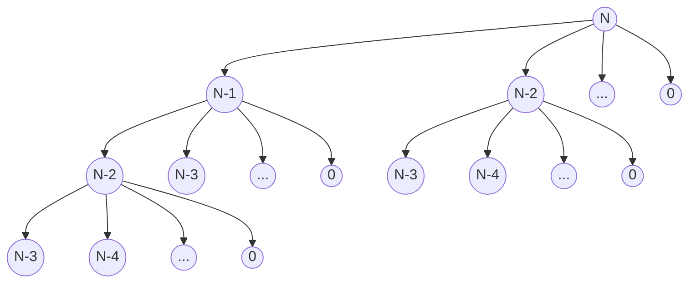

Reference Document: [HW 3.pdf](assets/HW%203-20231004155443-5gtxnor.pdf)

$$
C(0) = 1
$$

$$
C(N) = \frac{2}{N}\sum_{i=0}^{N-1}C(i)) + N
$$

## Recursion Tree



General Truncated Tree of the above recursion up to 3 levels and left most branch extended\
We can see that a number of branches are being repeated

## Brute Force Recursive Solution

```c++
float C(float N){
	if(N == 0)
		return 1;

	float sum=0;
	for(int i=0; i<=N-1; i++)
		sum += C(i);

	return 2/N * sum + N;
}
```

## Dynamic Programming

### Top Down Recursive Solution

#### Derivation of Proposed Formula

$$
C(N) = \frac{2}{N}\sum_{i=0}^{N-1}C(i)) + N
$$

$$
C(N) - N = \frac{2}{N}\sum_{i=0}^{N-1}C(i))
$$

$$
\frac{N}{2} * (C(N) - N) = \sum_{i=0}^{N-1}C(i))
$$

If we have the value of C(N) we can get its previous cumulative values

So say, if we find C(N-1) we can get previous sum from formula and add those values to get sum for C(N)

```c++
float C(float N, float *arr){
	arr[0] = 1;

	if(arr[(int) N] == 0.0){
		float prev_n = 0.0, prev_n_cumsum = 0.0;

		// Getting the Previous Sum
		prev_n = C(N-1, arr);

		// Calculating the cummulative sum before the previous sum
		// Equation derived from given recurrence
		prev_n_cumsum = (prev_n - (N-1)) * (N-1)/2;

		float total_sum = prev_n + prev_n_cumsum;

		arr[(int) N] = 2/N * total_sum + N;
	}
	return arr[(int) N];
}
```

### Bottom Up Iterative Solution

```c++
float C(int N, float *arr){
	// Our Base Case
	arr[0] = 1;

	// Since we are iterating from bottom to top, we can directly make use of
	// our memoization
	for(float i=1; i<=N; i++){
		float c_sum = 0;
		for(int j=0; j<i; j++)
			c_sum += arr[j];

		arr[(int)i] = ((2/i) * c_sum) + i;
	}

	return arr[N];
}
```
