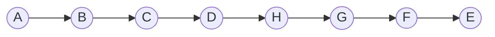
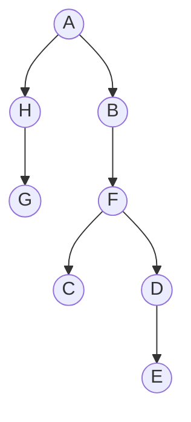

Reference Document: [HW 6 Graph Algorithms.pdf](assets/HW%206%20Graph%20Algorithms-20231129134803-odhba6m.pdf)

## Q1

### Kosaraju’s Two Pass Algorithm

The algorithm consists of the following steps:

* Run DFS on the original provided graph and note down <span class="text-highlight">finishing times</span>
* Sort the acquired finishing times in decreasing order
* Run DFS again but this time on Reversed Graph (with edges reversed in direction) starting and continuing from the decreasing order obtained in the previous step

#### Pass 1: G<sup>Original</sup> - DFS on A

DFS is applied on the original graph, starting from <span class="text-highlight">A</span> and finish times are noted.

Format = `s/f`​ where s = starting time while f = finishing time

| Vertex | Starting Time | Finishing Time |
| ------ | ------------- | -------------- |
| A      | 1             | 22             |
| B      | 2             | 21             |
| F      | 19            | 20             |
| C      | 3             | 18             |
| E      | 4             | 17             |
| K      | 13            | 16             |
| J      | 14            | 15             |
| H      | 11            | 12             |
| D      | 5             | 10             |
| G      | 6             | 9              |
| I      | 7             | 8              |

*Finish Times obtained from the DFS sorted in decreasing order*

#### Pass 2: G<sup>Rev</sup> - DFS on Decreasing Finishing Times

The original graph is reversed (direction of edges altered) and DFS is applied starting from the node with highest finishing time obtained in Pass 1, continuing with the unvisited node with the highest finish time if stopped in between.

#### Determined SCC from Pass 2

When the algorithm stops and continues from another node in the finish times list obtained from pass 1, we have found ourselves a <span class="text-highlight">Strongly Connected Component</span>. All the visited node on one go of DFS will then form an SCC and we can note them down.

| SCC # | Vertexes   |
| ----- | ---------- |
| 1     | A, B, C, F |
| 2     | E, J, K    |
| 3     | H          |
| 4     | D, I, G    |

## Q2

### Part A

Performing DFS on A

#### DFS Tree



### Part B

Performing DFS on A

#### DFS Tree​



## Q3

### (a)

Starting times (Pre) and Finish times (Post) when running DFS on A will be:

| Vertex | Pre | Post |
| ------ | --- | ---- |
| A      | 1   | 14   |
| B      | 15  | 16   |
| C      | 2   | 13   |
| D      | 3   | 10   |
| E      | 11  | 12   |
| F      | 4   | 9    |
| G      | 5   | 6    |
| H      | 7   | 8    |

### (b)

#### Sources

All those vertices will be source which have an `in-degree`​ of `0`​

Such as **Vertex A and B**

#### Sinks

All those vertices will be sink which have an `out-degree`​ of `0`​

Such as **Vertex G and H**

### (c)

The algorithm states that we should sort the finish times obtained by DFS in decreasing order and that order will be our topological order

#### Implementation

We will sort the vertices on their decreasing finishing times (post numbers)

| Vertex         | B  | A  | C  | E  | D  | F | H | G |
| -------------- | -- | -- | -- | -- | -- | - | - | - |
| Finishing Time | 16 | 14 | 13 | 12 | 10 | 9 | 8 | 6 |

According to the algorithm, the order will be:

<span class="text-highlight">B -> A -> C -> E -> D -> F -> H -> G</span>

### (d)

Since the dependencies of the middle vertices `C and F`​ are more than 1, we can alter the order of those dependencies and thus, the graph has a total of <span class="text-highlight">8</span> topological orderings:

* B <span>&rarr;</span> A <span>&rarr;</span> C <span>&rarr;</span> E <span>&rarr;</span> D <span>&rarr;</span> F <span>&rarr;</span> H <span>&rarr;</span> G

* A <span>&rarr;</span> B <span>&rarr;</span> C <span>&rarr;</span> E <span>&rarr;</span> D <span>&rarr;</span> F <span>&rarr;</span> H <span>&rarr;</span> G

* A <span>&rarr;</span> B <span>&rarr;</span> C <span>&rarr;</span> D <span>&rarr;</span> E <span>&rarr;</span> F <span>&rarr;</span> H <span>&rarr;</span> G

* B <span>&rarr;</span> A <span>&rarr;</span> C <span>&rarr;</span> D <span>&rarr;</span> E <span>&rarr;</span> F <span>&rarr;</span> H <span>&rarr;</span> G

* A <span>&rarr;</span> B <span>&rarr;</span> C <span>&rarr;</span> E <span>&rarr;</span> D <span>&rarr;</span> F <span>&rarr;</span> G <span>&rarr;</span> H

* A <span>&rarr;</span> B <span>&rarr;</span> C <span>&rarr;</span> D <span>&rarr;</span> E <span>&rarr;</span> F <span>&rarr;</span> G <span>&rarr;</span> H

* B <span>&rarr;</span> A <span>&rarr;</span> C <span>&rarr;</span> E <span>&rarr;</span> D <span>&rarr;</span> F <span>&rarr;</span> G <span>&rarr;</span> H

* B <span>&rarr;</span> A <span>&rarr;</span> C <span>&rarr;</span> D <span>&rarr;</span> E <span>&rarr;</span> F <span>&rarr;</span> G <span>&rarr;</span> H

## Q4

### Pseudo-Code

```
reverseGraph(G){
	G_Rev = []
	for vertex in G {
		// Each vertex will have an adjacency list
		G_Rev.append(Linked List)
	}

	// Visiting Each Vertex in the Original Graph
	for vertex in G {
		// Each vertex holds an adjacency list
		for(edge in vertex adjacency list) {
			G_Rev[edge].append(vertex) // append vertex to edge list
		}
	}
}
```

### Explanation

Since adjacency list format consists of linked lists, we can traverse the whole adjacency list in <u>O(V + E)</u> time and capture each edge linked to each node. We can then reverse the connection of the edges by assigning vertex to the edge list instead of assigning edge to vertex list in our reversed copy of the graph.

## Q5

### (a)

The given statement is <span class="text-highlight">false</span>.

The time complexity of Dijkstra’s algorithm is `O((|V| + |E|) * log(|V|))`​, where |V| is the number of vertices and |E| is the number of edges in the graph. Given the nature of the Korchoff graph, solving V + E will give us V<sup>2</sup> as the dominant term and thus the time complexity of dijkstra’s algorithm will be instead `O((V^2 * log(V)))`​ and not `O((V * log(V)))`​.

### (b)

#### Pseudocode

```
spKorchoff(G=(V, E), s, r) {
    dist = list of length V initialised to infinity
    dist[s] = 0
    queue = Queue()
    queue.enqueue(r) // starting from r

    while queue is not empty {
        u = queue.dequeue()
  
        for v adjacent to u {
			// we need to get Weight of edge
            weight = KorchoffWeight(u, v) // weight of the edge
            alt = dist[u] + weight

			// comparing the distances
            if alt < dist[v]:
                dist[v] = alt
                queue.enqueue(v)
		}
	}

    return dist
}
```

#### Explanation

We will start with all nodes having an infinite distance from the source `s`​, except the source itself which has a distance of 0. We will apply BFS from the root of the binary tree. As the algorithm visits each node during BFS, it checks and updates the shortest distance from the source s to its neighbours, according to the Korchoff edge weights. This distance is returned in the end in the form of a list.

## Q6

#### Pseudocode

```
shortestDistance(graph, start) {
    n = vertices in graph
    distance = array of size n initialized to infinity
    distance[start] = 0
    priority_queue = min-heap with element: (0, start)

    while priority_queue is not empty {
        cur_dist, u = extract_min(priority_queue)
        if cur_dist > distance[u]
            continue

        for each neighbor v of u in graph {
            if distance[u] + weight(u, v) < distance[v] {
                distance[v] = distance[u] + weight(u, v)
                insert_or_decrease_key(priority_queue, (distance[v], v))
			}
		}
	}

    return distance
}

produceAgentPaths(graph, A, hotels) {
    paths = []
    n = vertices in graph

    dist_A = shortestDistance(graph, A)

    for hotel in hotels {
        dist_hotel = shortestDistance(graph, hotel)
		min_total_risk = infinity

		for u = 0 to n-1 {
		    current_total_risk = dist_A[u] + dist_hotel[u]
		    if current_total_risk < min_total_risk {
	    	    min_total_risk = current_total_risk
    	    	min_path = u
			}
		}

        paths.append([hotel, min_path])
	}

    return paths
}
```

#### Explanation

The algorithm is divided into two different modules. The first function calculates the shortest distances from the given point to all the other points. It utilises dijkstra’s algorithm to produce that. The second function given all the hotels and the reaching point `A`​, first finds the shortest distance from point A to all the other hotels and then again for each hotel finds the shortest distance from that hotel to all vertices. Then for each hotel, it finds the vertex that minimises the sum of distances from A to the hotel and from the hotel to that vertex. This represents the path with the minimum total risk for the agent traveling from A to that hotel.
