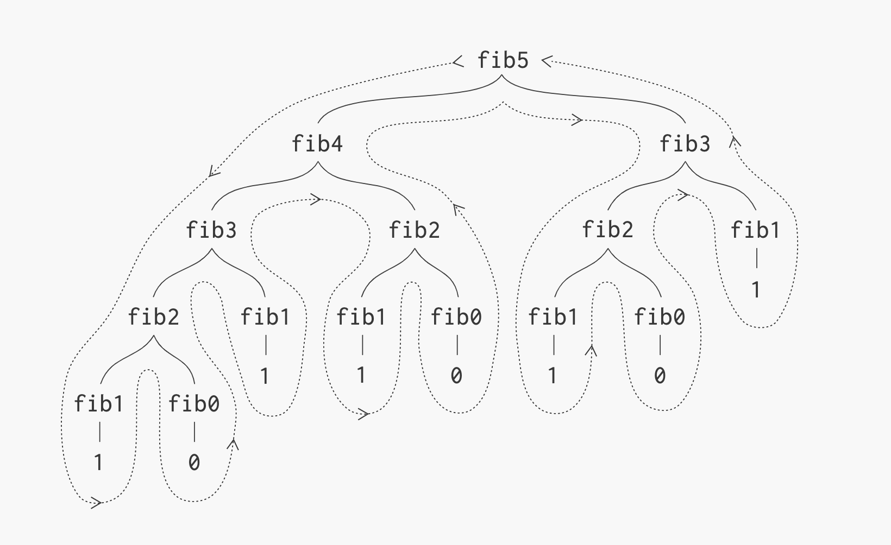

> Strategy to quickly and correctly solve large sub problems given solution to smaller sub problems

### DP vs Divide and Conqueror

They both solve bigger problems by dividing them into smaller sub problems and build solution of larger problems from the solution of smaller problems

However,

Divide and Conqueror applies to non-overlapping sub problems. That is the sub problems do not overlap with one another.

​​

Dynamic Programming on the other hand, applies when the ***sub problems overlap***. That is when a sub problems repeat for other branches too.

​​

## Memoization

> Dynamic Programming solves each sub problem only once and stores its result in a table, to avoid re-computation. This process is called memoization

Keep an array of sub problem’s solutions and use it to avoid re-computation results

## Optimal Substructure

DP applies to problems that contain optimal substructure.

These problems are:

> Problems which have an optimal solution and this solution within itself contains optimal solution to its sub problems

DP is used for optimisation problems: problems that have many solutions but we want the best one

## Requirements

For a problem to be able to solve by Dynamic Programming, it should contain the following traits:

* ### Overlapping Problems

  * Bigger problems can be divided into smaller overlapping sub problems in such as a way that solution to each sub problem is only calculated once
* ### Optimal Substructure

  * The optimal solution to bigger problems can be built by utilising the optimised solution of that of the smaller sub problems
