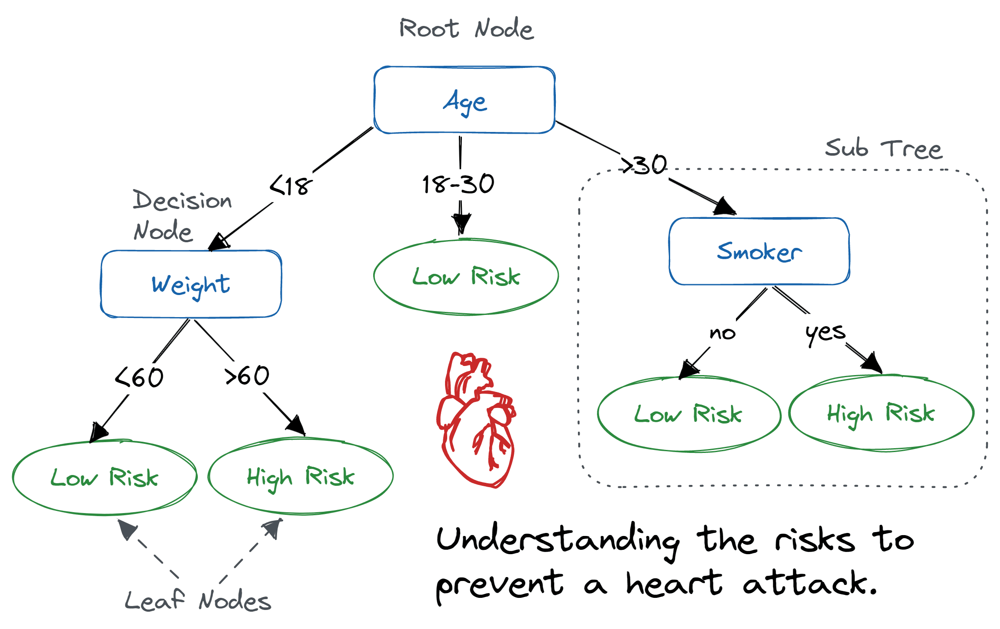

> A classification algorithm that predicts the class labels given the attributes by building a decision tree where each node represents the state of the attribute values

​​

* ## Criteria Splits

  The criteria on which an attribute is used to make a decision

  * ### Two-way / Binary Split

    * Create two criteria to split the tree branches
    * Utilised by:

      * Binary Attributes
      * Nominal Attributes
      * Ordinal Attributes
      * Continuous Attributes
  * ### Multi-way Split

    * Create multiple criteria to split the tree branches
    * Utilised by:

      * Nominal Attributes
      * Ordinal Attributes
      * Continuous Attributes

* ## Degree of Validation

  * Purity

    * The number of records imbalance the split criteria
    * Greedy Algorithms look for more degree of purity
    * ​​
  * Impurity

    * The number of records balance out the split criteria
    * Inverse of Purity
    * ​​
  * ### Measures

    Let $p_i(t)$ the frequency of class $i$ at node $t$ and $c$ the no. of classes:

    * #### Gini Index

      $$
      1-\sum_{i=0}^{c-1} p_i(t)^2
      $$

      The less the better

      * Always $\le$ 0.5
      * A Gini Index value of `0`​​​​​​​ means that the split is perfect\
        The less it is, the less variation in splitting is there
      * Classification Error vs Gini Index

        * Gini Index indicates information gain / loss and thus we will rely on Gini index incase we have the same classification errors
      * For Continuous Attributes

        * Sort the attribute in ascending order
        * Compute the Median

          * Either between every two values from the start
        * Compute the Gini Index Value by applying the split on the median value
    * #### Entropy

      Entropy is a measure of disorder or uncertainty and the goal of machine learning models and Data Scientists in general is to reduce uncertainty.

      $$
      -\sum_{i=0}^{c-1}p_i(t) \times log_2({pi(t)})
      $$

      The less the better

      * [Entropy ranges from 0-1 for binary classification problems and 0 to log base 2 k, where k is the number of classes you have](https://arc.net/l/quote/hzyjrarh)
    * #### Imperial / Classification Error

      $$
      1-max[p_i(t)]
      $$

      The less the better

      * Ratio of instances a class possesses
    * #### Information Gain

      $$
      Gain = P - M
      $$

      where $P$ is the impurity measure before splitting while $M$ is the weighted average of impurity measures of child nodes

      The more the better

      To determine how well a test condition performs, we need to compare the degree of impurity of the parent node (before splitting) with the degree of impurity of the child nodes (after splitting).

      If impurity decreases after combining parent split criteria with child split criteria then we gained some information

      * Gini Index / Entropy difference of parent and child split criteria
      * Always +ve
      * We choose those criteria which give us the highest information gain
      * Information gain is the main key that is used by Decision Tree Algorithms to construct a Decision Tree.
      * Decision Trees algorithm will always tries to maximise Information gain.

        * An attribute with highest Information gain will be tested/split first.
    * #### Gain Ratio

      $$
      Gain\space Ratio =  \frac{Gain_{Split}}{Split\space Info}
      $$

      $$
      Split\space Info = - \sum_{i=1}^{k}\frac{n_i}{n}log_2{\frac{n_i}{n}}
      $$

      where $n_i$ is the no. of records in child node

      Node impurity measures tend to prefer splits that result in large number of partitions, each being small but pure. Following this we can create $n$ number of splits and thus maximise information gain which would be incorrect for performance and overall measures

      * Normalised Information Gain
      * Divide Gain by Split Ratio
      * Helps us deal with the problem of class imbalance in branches

* ## Stopping Criteria

  * We stop splitting our tree if we find no variation in information gain

* ## Errors

  * Overfitting

    Likely occurs when constructing a decision tree using all of the available attributes

    * Pruning can help solve this issue
    * Model Selection

      * Validation Set

        Divide training set into two parts and use validation part to train the model

        * Training Set
        * Validation Set
      * Reduce Model Complexity
    * K Cross Validation

* ## Pruning

  * Reduce the Complexity of the Decision Tree by reducing the number of tree Branches
  * Helps us deal with overfitting
  * ### Pre-Pruning

    * Stop the algorithm before it becomes a fully-grown tree

      Typical stopping conditions for a node:

      * Stop if all instances belong to the same class
      * Stop if all the attribute values are the same
    * A more restrictive stopping condition must be used; e.g., stop expanding a leaf node when the observed gain in impurity measure (or improvement in the estimated generalization error) falls below a certain threshold.
    * Faster Results
    * Inaccurate
  * ### Post-Pruning

    * Grow decision tree to its entirety

      Subtree replacement

      * Trim the nodes of the decision tree in a bottom-up fashion
      * If generalisation error improves after trimming, replace sub-tree by a leaf node
      * Class label of leaf node is determined from majority class of instances in the sub-tree
    * Accurate
    * Slower

* ## Random Forests

  * Decision trees do actually learn complex patterns quite easily and hence their will always be a risk of overfitting and hence additional measures should be taken to overcome that
  * Bagged Decision Trees where features are controlled as in allocation to different subsets

    * Reduces memorization effect
  * Classification is done on majority vote

## Algorithms

Construction of the decision tree

### General Pseudocode

​​

* ### Hunt’s Algorithm

  * Greedy Algorithm
  * Basis of other decision tree algorithms
  * Steps

    Let `D`​ be a set containing some records and a target attribute describing classes\
    Let `T`​ be the node in the decision tree which needs to be discovered, it could be root

    1. If `D`​ contains records that belong the same class, then `T`​ is a leaf node

       *Else*

       If `D`​ contains records that belong to more than one class, use an attribute test to split the data into smaller subsets.
    2. Recursively apply the procedure from step 1 to each subset.
* ### ID3

  * Works in the same way as Hunt’s Algorithm
  * Uses Information Gain and Entropy
* ### CART

  * Only creates Binary Tree
  * Uses Gini Index and Gain Ratio

## Resources

* [Decision Tree, Entropy, Information Gain | Kaggle](https://www.kaggle.com/code/abrahamanderson/decision-tree-entropy-information-gain "Decision Tree, Entropy, Information Gain | Kaggle")
