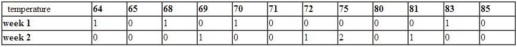
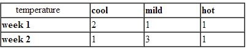
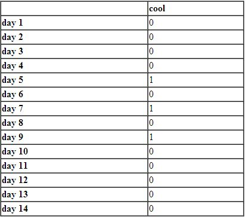
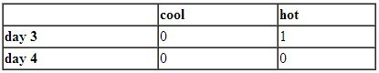
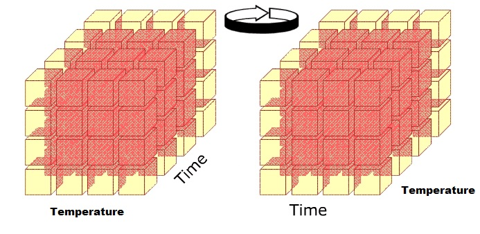

***

* <https://athena.ecs.csus.edu/~mei/olap/OLAPoperations.php>
* 2023-09-30 12:42:18

***

In the multidimensional model, data are organised into multiple dimensions, and each dimension contains multiple levels of abstraction defined by concept hierarchies. This organisation provides users with the flexibility to view data from different perspectives.

For example, we have attributes as day, temperature and humidity, we can group values in subsets and name these subsets, thus obtaining a set of hierarchies as shown in figure below.

​**Fig 6:**  Concept hierarchy.

> OLAP provides a user-friendly environment for interactive data analysis.  A number of OLAP data cube operations exist to materialise different views of data, allowing interactive querying and analysis of the data.

The most popular end user operations on dimensional data are:

## Roll up

The roll-up operation (also called drill-up or aggregation operation) performs aggregation on a data cube, either by climbing up a concept hierarchy for a dimension or by climbing down a concept hierarchy, i.e. dimension reduction. Let me explain roll up with an example:

Consider the following cube illustrating temperature of certain days recorded weekly:

​\
**Fig 7:**  Example.

Assume we want to set up levels (hot(80-85), mild(70-75), cold(64-69)) in temperature from the above cube. To do this we have to group columns and add up the values according to the concept hierarchy. This operation is called roll-up.\
By doing this we obtain the following cube:

​\
**Fig 8:**  Rollup.

The concept hierarchy can be defined as hot&rArr;day&rArr;week. The roll-up operation groups the data by levels of temperature.

## Roll Down

The roll down operation (also called drill down) is the reverse of roll up. It navigates from less detailed data to more detailed data. It can be realised by either stepping down a concept hierarchy for a dimension or introducing additional dimensions.  Performing roll down operation on the same cube mentioned above:

​\
**Fig 9:**  Roll down

The result of a drill-down operation performed on the central cube by stepping down a concept hierarchy for temperature can be defined as day&lArr;week&lArr;cool. Drill-down occurs by descending the time hierarchy from the level of week to the more detailed level of day. Also new dimensions can be added to the cube, because drill-down adds more detail to the given data.

## Slicing

Slice performs a selection on one dimension of the given cube, thus resulting in a sub-cube. For example, in the cube example above, if we make the selection, temperature=cool we will obtain the following cube:

​\
**Fig 10:**  Slicing

## Dicing

The dice operation defines a sub-cube by performing a selection on two or more dimensions.  For example, applying the selection (time = day 3 OR time = day 4) AND (temperature = cool OR temperature = hot) to the original cube we get the following sub-cube (still two-dimensional):

​\
\*\*Fig 11: \*\* Dicing

## Pivot

Pivot otherwise known as Rotate, changes the dimensional orientation of the cube, i.e. rotates the data axes to view the data from different perspectives. Pivot groups data with different dimensions. The below cubes shows 2D representation of Pivot.

​\*\*Fig 12: \*\* Pivot

## Other OLAP operations

Some more OLAP operations include:

### **SCOPING**

Restricting the view of database objects to a specified subset is called scoping. Scoping will allow users to receive and update some data values they wish to receive and update.

Example could be if you hide the `time`​ dimension

### **SCREENING**

Screening is performed against the data or members of a dimension in order to restrict the set of data retrieved.

Example could be if you hide the level `quarter`​ of the `time`​ dimension

### **DRILL ACROSS**

Accesses more than one fact table that is linked by common dimensions. Combines cubes that share one or more dimensions.

For example, let’s say you have two fact tables: one containing sales data and another containing inventory data. Both fact tables are associated with a common “time” dimension. By drilling across these fact tables based on the “time” dimension, you can combine information about sales and inventory for specific time periods, gaining insights into the relationship between sales and stock levels.

### **DRILL THROUGH**

Drill down to the bottom level of a data cube, down to the grain levels of it dimensions.

For example, if you have a cube with aggregated sales data by product category, region, and time period, a “Drill Through” operation might allow you to view individual sales transactions, customer details, or other information that contributes to the aggregated sales figures.

## Summary

* Concept hierarchies organise the values of attributes or dimensions into abstraction levels. They are useful in mining at multiple abstraction levels.
* Typical OLAP operations include roll-up, and drill-( down, across, through), slice-and-dice, and pivot ( rotate), as well as some statistical operations.
* OLAP operations can be implemented efficiently using the data cube structure.
