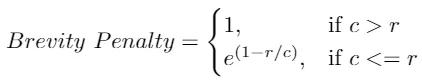
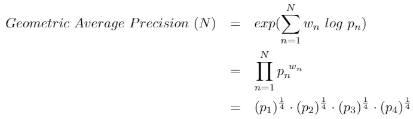

***

* <https://www.traceloop.com/blog/demystifying-the-bleu-metric>
* 2024-05-07 22:48:53

***

As natural language processing (NLP) continues to advance, the ability to evaluate NLP models is becoming increasingly important.

From facilitating text summarization to enabling text generation, NLP has become crucial for businesses and researchers. One significant application of NLP is machine translation (MT), or translating text or speech from one language to another.

Human evaluations of the results of MT can take months, and they’re expensive because they involve labor that can’t be reused. Also, every time you tweak a model, you need to re-evaluate its results. To overcome these challenges, we need an automatic way to assess the performance of MT systems.

For this purpose, we’re creating a series of articles that explain different metrics for evaluating the quality of machine learning model outputs. In a previous article, we discussed the [ROUGE metric](https://www.traceloop.com/blog/evaluating-model-performance-with-the-rouge-metric-a-comprehensive-guide) for evaluating text summarization tasks.

In this article, we’ll discuss using the BLEU (Bilingual Evaluation Understudy) metric to evaluate the performance of MT models, as well as the metric’s significance and limitations. You’ll notice a lot of similarities to the ROUGE metric.

## **What Is a BLEU Score?**

BLEU is a metric used to determine how well machine-translated text matches one or more human reference translations. The higher the BLEU score, the closer the computer-generated text is to the human-translated reference text.

### **How Does a BLEU Score Work?**

To evaluate how closely the machine-translated text matches the reference text, the BLEU metric, like the ROUGE metric, looks at n-grams — sequential groups of words such as unigrams (single words), bigrams (two-word sequences), trigrams (three-word sequences), and so on.

BLEU assesses the accuracy of the n-grams in the machine-generated translation by comparing them with reference translations, quantifying the similarity. To further refine its score, BLEU applies a brevity penalty in instances where a translation is shorter than the reference text.

This is the formula for a BLEU score:

BLEU = $BP * exp(∑ pn)$

Where

* BP (brevity penalty) acts as a corrective factor in scoring for translations that fall short of the length of the reference text. The penalty is determined by min(1, (reference\_length / translated\_length)), with reference\_length representing the total word count in reference text and translated\_length representing the total word count in the machine-generated translation.
* pn, reflecting gram precision, quantifies the precision of n-grams by evaluating the ratio of shared n-grams between the machine-generated translation and the reference text, compared with the overall count of n-grams in the machine-generated translation.

## **How to Use BLEU**

A BLEU score is an indication of the quality of machine-translated text, or a candidate sentence, compared with a reference text or texts — there can be more than one reference for one candidate sentence. Therefore, it’s important to choose references carefully and make sure that you include all the possible references.

A BLEU score can range from 0 to 1; the closer to 1 the score is, the better the translation is deemed to be. However, it’s impossible to achieve a score of 1; generally, a value greater than 0.3 is considered a good score.

Before we explore BLEU’s calculation process, let’s discuss two essential concepts: n-grams and precision.

### **N-grams**

We discussed n-grams in our article about [the ROUGE metric](https://www.traceloop.com/blog/evaluating-model-performance-with-the-rouge-metric-a-comprehensive-guide), but revisiting the concept here will be helpful.

The n-gram concept is widely used in standard text processing and is not exclusive to the BLEU metric or NLP. An n-gram essentially represents a set of consecutive words in a sentence.

For example, in the phrase “the cat jumped high,” the n-grams are:

* **1-gram (unigram):**  “the,” “cat,” “jumped,” and “high”
* ​**2-gram (bigram):**  ​“the cat,” “cat jumped,” and “jumped high”
* **3-gram (trigram):**  “the cat jumped” and “cat jumped high”
* **4-gram:**  “the cat jumped high”

The order of words in an n-gram is crucial, so “high jumped cat the” wouldn’t form a valid 4-gram.

### **Precision**

The precision metric compares the word count in the machine-translated or predicted sentence with that of the reference or target sentence.

Let’s consider the following scenario:

* **Target Sentence:**  She plays the piano.
* **Predicted Sentence:**  She plays a piano.

Typically, precision is calculated using this formula:

precision = number of correct predicted words / total number of predicted words

In this instance, precision = 3/4

However, relying completely on precision has limitations:

#### **Repetition**

A primary problem with this formula is that it can be manipulated. For example:

* **Target Sentence:**  She plays the piano.
* **Predicted Sentence:**  She She She.

This sentence would earn a perfect precision score: 3 / 3 = 1.

#### **Multiple Target Sentences**

Another concern arises from the variability in expressing the same sentence. In several NLP models, multiple correct versions of a target sentence might exist.

To address both limitations, a modified precision (MP) formula, termed “clipped precision” has been introduced.

#### **Clipped Precision**

Consider the following sentences:

* **Target Sentence 1:**  She plays the piano.
* **Target Sentence 2:**  She is playing piano.
* **Predicted Sentence:**  She She She plays playing keyboard.

Now, let’s do two things in a different way:

* We’ll check every word in the predicted sentence against all the words in the target sentences. When a word matches any word in the target sentence, it’s counted as correct.
* To manage repetition, we restrict the count of each correct word to the highest number of times it appears in the target sentence. This approach will be clearer in the following explanation.

​​

In our example, the word “She” appears once in each target sentence. Even though it occurs three times in the predicted sentence, we limit the count to one, the maximum count in any target sentence.

Clipped precision = number of clipped correct predicted words / total number of predicted words

In this case, clipped precision = 3 / 6.

Note: For the rest of this article, we’ll refer to clipped precision as precision.

Now we’re set to calculate the BLEU score.

### **How Is a BLEU Score Calculated?**

Let’s look at another example:

**Target Sentence:**  The guests arrived late because their tire got punctured.

**Predicted Sentence:**  The guests arrived late because of a punctured tire.

The BLEU score will use precision scores for n-grams, usually for n between 1 and 4.

Now, let’s calculate the 1-gram precision score.

#### **Precision 1-gram**

Use the precision method to calculate the 1-gram precision score:

**precision 1-gram (p1) = count of predicted 1-grams / count of total predicted 1-grams**

**Target Sentence:**  The guests arrived late because their tire got punctured.

**Predicted Sentence:**  The guests arrived late because of a punctured tire.

Precision 1-gram (p1) = (1+1+1+1+1+0+0+1+1)/8 = 7/9.

**p1 = 0.777**

Similarly, you can calculate the precision score using 2-grams, 3-grams, and 4-grams.

### **Brevity Penalty**

After calculating the precision score, the next step is to compute a brevity penalty. Sometimes with longer texts, the prediction might be very short and miss critical information in the target sentence.

For instance, if we have only one word in the prediction, then for 1-gram precision, the result would be 1, resulting in a perfect score. This would definitely be misleading.

To overcome this, the brevity penalty penalizes texts that are too short.

​​

Where

* c is the length of the predicted text.
* r is the length of the target sentence.

Here, c = 9 and r = 9, which means the brevity penalty = 1.

[If our output is shorter than any reference sentence, we divide the length of the closest sentence by the length of our output, subtract one from that, and raise e to the power of that whole shebang. Basically, the longer the shortest reference sentence and the shorter our output, the closer the brevity penalty gets to zero.](https://arc.net/l/quote/tkmrijrt)

### **BLEU Score**

Lastly, to calculate the BLEU score, we need to multiply the brevity penalty by the geometric average of the precision score.

BLEU Score (N) = Brevity Penalty \* (Geometric Average Precision Score)

Here’s how you can calculate the geometric average precision score.

​​

This can be calculated for different values of N and different weight values.

As noted before, generally, we use N=4 and uniform weights wₙ = N / 4.

**BLEU Reference Corpus**

Note: Though we used a single-text pair for ease of understanding, a BLEU score is generally calculated for the entire corpus with multiple references for each predicted text.

## **Pros and Cons of BLEU**

The BLEU metric boasts several advantages that contribute to its widespread adoption and effectiveness in evaluating machine-generated text:

* **Quick and Easy:**  BLEU is fast to calculate and not complicated to grasp, making it efficient for evaluating machine-generated text. This simplicity is particularly advantageous when dealing with large volumes of data, as it allows for swift and practical assessments in real-time applications.
* **Human-Like Evaluation:**  BLEU aligns with how a human would evaluate the quality of the same text, which adds a human-centric element to the assessment. This human-like approach fosters a more intuitive understanding of the machine-generated text’s linguistic quality, enhancing the metric’s reliability.
* **Language Independence:**  BLEU is applicable across different languages such as English, Spanish, French, and Czech, so it’s versatile and easy to use with various NLP models. This versatility simplifies the evaluation process for multilingual applications, providing a consistent and standardized measure of performance.
* **Multiple Reference Sentences:**  BLEU can handle situations where you have more than one correct or reference sentence, providing flexibility in evaluation. This adaptability allows for a more comprehensive assessment, as it accommodates the diverse ways in which a particular translation or text can be expressed.
* **Wide Usage:**  BLEU is widely used in the NLP community, which makes it easy to compare results with those of other studies or models and provides a common ground for assessment. This widespread adoption also promotes benchmarking and facilitates collaborative efforts in refining and advancing NLP models and techniques.

But while the BLEU metric offers valuable insights into the quality of machine-generated text, it has certain limitations that merit consideration:

* **Lack of Semantic Understanding:**  BLEU does not consider the meanings of words, leading to penalties for synonyms or words with similar meanings that may be acceptable to humans. For instance, using “watchman” instead of “guard” is acceptable to humans but would negatively impact a BLEU score.
* **Exact Matching:**  It focuses on exact matching words, not accounting for variations or word forms that might convey the same idea, such as different tenses or forms. For example, “rain” and “raining” might convey the same idea, but BLEU would not consider these two words to be a match.
* **Equal Weight to All Words:**  BLEU treats all words equally, not distinguishing between crucial words and less important ones, which might affect the overall meaning of a sentence. A potentially less significant word like “to” is penalized as much as a crucial one, impacting the overall score.
* **Insensitive to Word Order:**  BLEU doesn’t take into account the order of words in a sentence, leading to situations where rearranged sentences with the same words receive the same (1-gram) BLEU score despite potential differences in meaning. The sentences “The guard arrived late because of the rain” and “The rain arrived late because of the guard” would receive the same (1-gram) BLEU score despite their significant differences.

## **Final Words**

With its strengths and limitations, the BLEU metric has become essential for assessing the quality of machine-generated text, particularly in language translation. The intuitive nature of BLEU, combined with its quick calculation and alignment with human evaluation, makes it a versatile tool in the ever-expanding landscape of NLP.

We are creating a series of articles to discuss and learn different metrics to evaluate machine learning models. If you haven’t read the other articles in this series, about the [ROUGE metric](https://www.traceloop.com/blog/evaluating-model-performance-with-the-rouge-metric-a-comprehensive-guide) and the [GRUEN metric](https://www.traceloop.com/blog/gruens-outstanding-performance-in-llm-quality-evaluation), read it now. [Sign in to our platform, Traceloop](https://app.traceloop.com/), to try out these metrics yourself, and [follow us on X (Twitter)](https://twitter.com/traceloopdev) to stay informed as we publish the next blog posts in this series.
