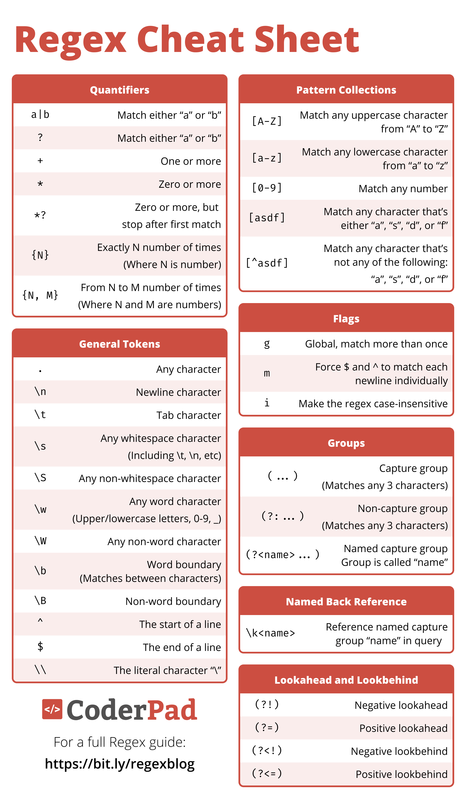

> A regex is a string of text that lets you create patterns that help match, locate, and manage text.

Regex can be used any time you need to query string-based data, such as:

* Analysing command line output
* Parsing user input
* Examining server or program logs
* Handling text files with a consistent syntax, like a CSV
* Reading configuration files
* Searching and refactoring code

While doing all of these is *theoretically* possible without regex, when regexes hit the scene they act as a superpower for doing all of these tasks.

## Errors

### Type 1 Errors

* False Positives

  * Words which exist but should not be in the result

### Type 2 Errors

* False Negatives

  * The words which are left out but were actually supposed to be in the result

## Resources

[regex101: build, test, and debug regex](https://regex101.com/)

[The Complete Guide to Regular Expressions (Regex) - CoderPad](https://coderpad.io/blog/development/the-complete-guide-to-regular-expressions-regex/)

[Regular expression syntax cheat sheet - JavaScript | MDN](https://developer.mozilla.org/en-US/docs/Web/JavaScript/Guide/Regular_expressions/Cheatsheet)

## Cheat Sheet

​​
