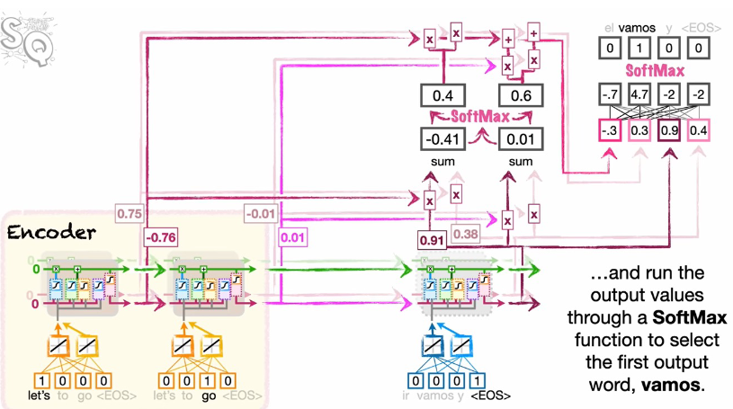

> Sequence to Sequence (often abbreviated to seq2seq) models is a special class of Recurrent Neural Network architectures that we typically use (but not restricted) to solve complex Language problems like Machine Translation, Question Answering, creating Chatbots, Text Summarisation, etc.

* From the given input sequence, we generate an output predicted sequence

  * Example, Predict response of an input text, as in the case of a chat
* [What is Sequence to Sequence and how does the Attention work?](assets/Seq2Seq-Attention.pdf)

## Applications

* Machine Translation (MT)
* Summarisation
* Dialogue
* Parsing
* Code Generation
* Natural Language Generation (NLG)

## Involves two Sequence Models

These sequence models can be RNN, LSTM or GRU

One is called Encoder while the other is called Decoder

The layer count of the encoder and decoder are the same

* ### Encoder

  * The architecture that is responsible for understanding the source and its context
* ### Decoder

  * The architecture followed by encoding process that is used to generate a new translated sentence
  * This part behaves the same as calculating conditional probability as in the case of  N-Grams
  * Input of next time step is the output of the previous time step

    * In case of first time step, the output of encoder RNN is used as input
  * ##### Greedy Decoding

    * Take most probable word on each step
    * Does not allows turning back if a wrong output is generated at a time step\
      Since this output is a seed to the next time stamp, it can cause further problems
  * ##### Exhaustive Search Decoding

    * Generate as many sentences as it can generate given the outputs
    * More of like a tree of words that keeps on growing but only one branch in form of a sentence is what we needed
    * Can be actually exhausting to search and create all the possible branches
  * ##### Beam Search Decoding

    * Generates not optimal but at least sub-optimal results
    * Take out `K`​ probable words at each time steps

      * K is also called as Beam Size
      * The more the Beam Size, the more possibilities we will be exploring
    * More of like the same tree as in ((20240415152530-78796q9 “Exhaustive Search Decoding”)) but with limited branches or child
    * ###### Pruning

      * We will prune out those branches which have lower chain probabilities\
        Probabilities here are the same conditional probabilities as: $P(X_i|X_{i-1})$
* ### Back Propagation

  * Since we have the outputs in the form of words and at each time step a word is generated that is used as input in the next time step, we have $T$ possible outputs
  * We can combine the errors of these $T$ outputs into a single metric or value
  * This value is then served as our *Cost Function.*

    This cost function is then further used to Back Propagate from the Decoder model till the Encoder model while updating the weights in the same way a normal RNN does.
* ### Attention Mechanism

  Mainly used in Transformers

  * Add bunch of new paths from the Encoder to the Decoder, one per input value, so that each step of the decoder can directly input values

    * These paths are also called as Skip-links
  * #### Attention Score

    * The similarity score that helps us to define if any context of the input coming from the Encoder should be used to generate the current word
  * #### Procedure

    ​​

    1. Calculate prediction of current unit of the decoder
    2. Calculate similarity of the computed prediction with hidden output $h_t$ of each and every input in the encoder through <u>dot product</u>

       In case of multiple layers, similarity of the prediction of corresponding layer of the decoder is calculated with the corresponding encoder ones and summed up for each input

       The final output in the end is the similarity scores equal to the number of inputs
    3. Calculated scores are further fed into <u>softmax</u> to fetch probabilities or percentages
    4. The found percentage of hidden output $h_t$ of each and every input in the encoder is then fetched and summed up to get the final attention

       The number of attentions will be equal to the number of layers in the net
