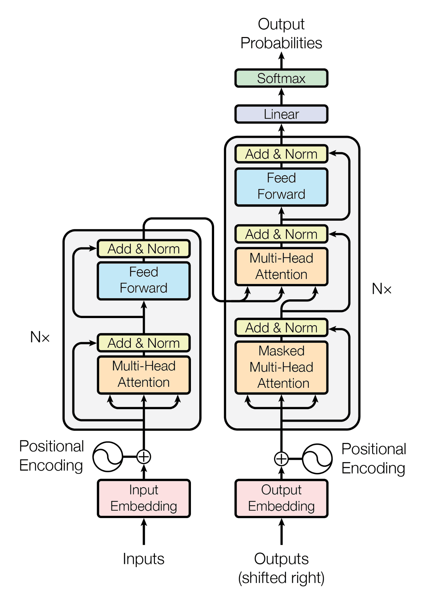

> A transformer is **a deep learning** sequence-to-sequence **architecture developed by Google** representing departure from the traditional RNN and LSTM based seq-to-seq models **and based on the multi-head attention mechanism**, proposed in a 2017 paper [“Attention Is All You Need”](assets/attention-is-all-you-need-20240428205150-tbz6s25.pdf).

* Introduced in the paper [“Attention Is All You Need”](assets/attention-is-all-you-need-20240428205150-tbz6s25.pdf) by Vaswani et al. (2017)
* [The Illustrated Transformer – Jay Alammar](https://jalammar.github.io/illustrated-transformer/ "The Illustrated Transformer – Jay Alammar – Visualizing machine learning one concept at a time.")
* [Solving Transformer by Hand: A Step-by-Step Math Example](https://levelup.gitconnected.com/understanding-transformers-from-start-to-end-a-step-by-step-math-example-16d4e64e6eb1)
* [The matrix math behind transformer neural networks, one step at a time!!! - YouTube](https://www.youtube.com/watch?v=KphmOJnLAdI "The matrix math behind transformer neural networks, one step at a time!!! - YouTube")

<iframe sandbox="allow-forms allow-presentation allow-same-origin allow-scripts allow-modals" src="https://www.youtube.com/embed/zxQyTK8quyY" data-src="" border="0" frameborder="no" framespacing="0" allowfullscreen="true" style="width: 745px; height: 420px;"></iframe>

## Transition from Traditional Seq-toSeq Models

In traditional sequence-to-sequence models like those based on RNNs and LSTMs, the input sequence is processed one token at a time, typically in a recurrent manner where each token is processed sequentially, and the hidden state evolves over time. Transformers on the other hand, use an attention mechanism to directly capture dependencies between all pairs of tokens in the input sequence simultaneously. This means that the entire input sequence is processed in parallel, rather than sequentially. This parallel processing is made possible by the self-attention mechanism, which allows each token in the sequence to attend to all other tokens, enabling the model to capture long-range dependencies more effectively.

So, in transformers, the input sequence is not fed one token at a time, but rather the entire sequence is processed simultaneously in parallel.

## Why Transformers

* **Long-Range Dependencies**: Transformers excel at capturing long-range dependencies in sequences due to their self-attention mechanism. This allows them to model relationships between tokens that are far apart in the sequence more effectively than recurrent architectures.
* **Parallelisation**: Because transformers process the entire input sequence in parallel, they can be more computationally efficient compared to recurrent architectures, which process tokens sequentially. This parallelisation can lead to faster training times and better scalability to longer sequences.
* **Reduced Vanishing Gradient Problem**: Recurrent architectures like RNNs suffer from the vanishing gradient problem, where gradients diminish over long sequences, making it challenging to capture dependencies over long distances. Transformers mitigate this issue by directly attending to all tokens in the sequence, which helps propagate gradients more effectively during training.
* **Ease of Implementation**: Transformers have a simpler architecture compared to recurrent models, making them easier to implement and understand. They also lend themselves well to parallel computing architectures such as GPUs and TPUs, leading to efficient training and inference.

## Architecture

​​

1. **Encoder-Decoder Architecture**: Transformers typically consist of an encoder and a decoder. The original paper “Attention is all you need”, there were $6$ encoders and $6$ decoders. The encoder processes the input sequence and generates a sequence of hidden representations, while the decoder generates the output sequence based on the encoder’s representations and any previous output tokens. This training is done in ==$O(1)$==.
2. **Positional Encoding**: Since Transformers do not inherently understand the order of tokens in a sequence, positional encoding is added to the input embeddings to provide information about the positions of tokens in the sequence. This allows the model to take into account the sequential order of tokens.
3. **Self-Attention Mechanism**: The core of the Transformer architecture is the self-attention mechanism, which enables the model to weigh the importance of different words in a sequence when processing each word. Self-attention allows the model to capture long-range dependencies and relationships between words in the input sequence.
4. **Multi-Head Attention**: In Transformers, self-attention is often implemented using multiple attention heads, each of which learns different attention patterns. Multi-head attention allows the model to capture different types of dependencies in the input sequence simultaneously, enhancing its representational capacity.
5. **Feed-Forward Neural Networks**: Transformers typically include feed-forward neural networks (FFNs) as part of their architecture. FFNs are applied independently to each position in the sequence and help capture non-linear relationships between tokens.
6. **Layer Normalisation and Residual Connections**: Transformers use layer normalisation and residual connections to stabilise training and improve gradient flow through the network. These techniques help prevent the vanishing gradient problem and facilitate training deeper architectures.

### Parallel Computing in Transformers

Transformers can train in O(1). This is because the operations performed on an input by transformers are independent of other inputs. That is, each input does not need to wait for the previous or next input to compute something or depend on it.

This process can be broken down into:

#### Encoder Level

For each input sequence in parallel, we:

1. Apply Word Embeddings

2. Apply Positional Encoding

3. Compute Queries, Keys and Values

   The entire process up till now can be done in parallel for any number of simultaneous inputs and thus at this point we would have Queries, Keys and Value for all of our inputs which we can use to proceed further in parallel too

4. Apply Self Attention

   1. Compute Scores for other inputs
   2. Normalise the Scores
   3. Apply SoftMax
   4. Compute weighted sum of values of each input, with SoftMax percentages at weights

5. Apply Residual Connections

6. Apply FFNN

#### Decoder Level

If we are inferring / predicting then we need to wait for the first output to generate so that we can feed it as input to the second time frame, hence the overall time would be O(n) for inferring.

However if we are training the model, we already know the actual output and thus we can utilise the parallel nature of the operations that are to be performed on the decoder inputs. That is, we can give the entire actual output sequence to the decoder as input all at once. Thus, this initialising of the Decoders with known output values during Training is called Teacher Forcing. But, this sequence is shifted right, because the first input has to be a EOS (End of Sequence) or SOS (Start of Sequence) token. In this way, we will be inferring output for each position all at once. Hence, doing all of it in parallel with O(1) complexity.

* Finally, we get one final matrix at the end, where each row or column would represent the sentence position and the other each row or column would represent the SoftMax probabilities for each of the word in our output vocabulary
* We then compute the cross entropy loss for each of the position using the position’s probability distributions and the actual word that needs to be in that position
* Further, we take the average of the loss for all of the positions
* This loss is then used to back-propagate and train the entire model

## Variants

* Bidirectional Encoder Representations from Transformers (BERT)
* GPT
