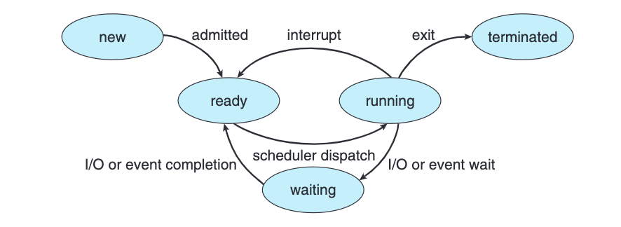

[The 5 State Process Model](assets/Abraham-Silberschatz-Operating-System-Concepts-10th-2018-20230917173659-aljli44.pdf#page=147)\
​​

## New State

* Jobs are called programs here
  * Waiting in the hard disk for memory allocation
* Linking and Loading is still yet to be done
* Program is waiting to be converted into a process / Allocate a Process Control Block

### Job Queue

* The programs which are still yet to be converted to a process are waiting here

## Long-Term / Job Scheduler

* Schedules jobs from the job queue to be put into the main memory
* Long-term scheduler is invoked infrequently (seconds, minutes) &rarr; (may be slow)
* Manages the Degree of Multiprogramming

  * Keeps track of the count of available space in the memory to load processes
  * A mixture of I/O bound and CPU Bound processes are selected to be loaded in the memory

## Ready State

* Loaded in the main memory waiting to be executed

### Ready Queue

* The multiple processes which are yet to be executed are queued here

## Short-Term / CPU

* Schedules processes from ready queue to be executed into the CPU
* Short-term scheduler is invoked frequently (milliseconds) &rarr; (must be fast)
* Algorithms should be devised from the number of processes available in the ready queue such that the *throughput of the CPU* can be maximum

## Running State

* The process is executed in the CPU in here

### Migrations from Running to Ready Stage

* Interrupts between processing
* Based on Scheduling Time

## Waiting State

* If a process while in running stage requires an I/O event to occur then it is put into this stage
* Process requesting I/O operations are put here

### Device Queue

* Multiple requests to use a specific device are put here

On the completion of that specific I/O operation, the state of the process is transitioned to Ready State

## Exit State

* If a process is completed entirely then it is put here
