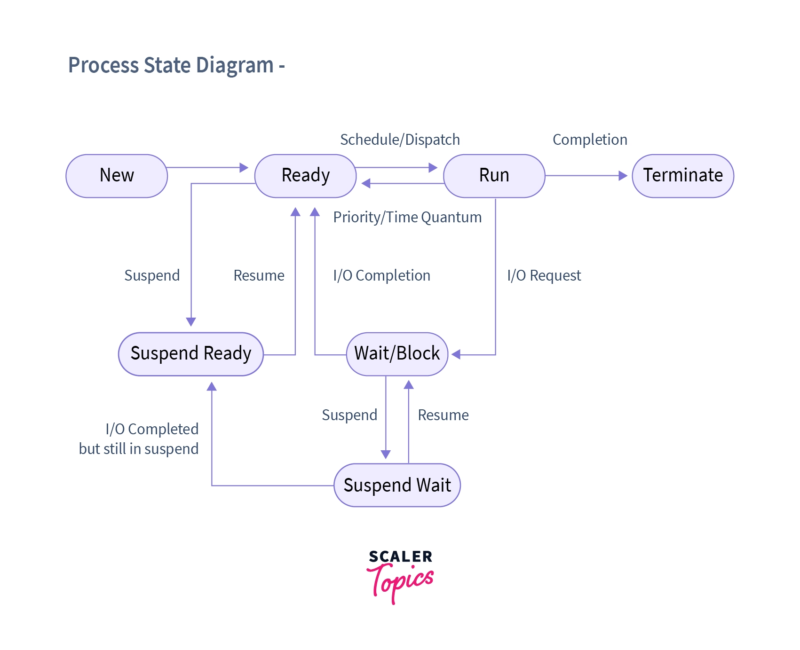

5 State Process Model transformation because of Medium Term Swapper

​​

### New State

* Jobs are called programs here
  * Waiting in the hard disk for memory allocation
* Linking and Loading is still yet to be done
* Program is waiting to be converted into a process / Allocate a Process Control Block

#### Job Queue

* The programs which are still yet to be converted to a process are waiting here

### Long-Term / Job Scheduler

* Schedules jobs from the job queue to be put into the main memory
* Long-term scheduler is invoked infrequently (seconds, minutes) &rarr; (may be slow)
* Manages the Degree of Multiprogramming

  * Keeps track of the count of available space in the memory to load processes
  * A mixture of I/O bound and CPU Bound processes are selected to be loaded in the memory

### Ready State

* Loaded in the main memory waiting to be executed

#### Ready Queue

* The multiple processes which are yet to be executed are queued here

### Short-Term / CPU

* Schedules processes from ready queue to be executed into the CPU
* Short-term scheduler is invoked frequently (milliseconds) &rarr; (must be fast)
* Algorithms should be devised from the number of processes available in the ready queue such that the *throughput of the CPU* can be maximum

### Running State

* The process is executed in the CPU in here

#### Migrations from Running to Ready Stage

* Interrupts between processing
* Based on Scheduling Time

### Waiting State

* If a process while in running stage requires an I/O event to occur then it is put into this stage
* Process requesting I/O operations are put here

#### Device Queue

* Multiple requests to use a specific device are put here

On the completion of that specific I/O operation, the state of the process is transitioned to Ready State

### Exit State

* If a process is completed entirely then it is put here

***

## Suspending / Swapping Processes

> Remove process from memory, store on disk, bring back in from disk to continue execution

### Medium-Term / Swapper

* Introduces a 7 State Process Model
* Swaps in and out some processes from ready or waiting queue in to *Suspend queue*
  * The process that is swapped out is called the victim process

#### Dispatch Latency

> The time it takes for the dispatcher to stop one process and start another running is known as the dispatch latency

### **Why is there a need to Suspend Processes?**

[Swapping may be necessary to improve the job mix, or because a change in memory requirements has over committed available memory, requiring memory to be freed up](assets/Operating%20Systems%20-%20CS604%20Handouts-20230917173807-mvuhx4l.pdf#page=34)

* To Free Resources

  * Free up Memory / CPU use by that specific process
* I/O Operations

  * The process maybe waiting for the I/O operation to be completed
* Synchronisation and Coordination

  * The process may be waiting for some other process to complete

### Suspend Ready State

* If memory becomes full, there is a need to swap out some processes from main memory into the secondary memory, thus in that scenario, we will move those processes from Ready State to Suspend Ready State

  * That is they are ready to execute but are residing in the secondary memory

The operating system prefers to suspend a blocked process instead of a ready process as blocked process cannot be executed while a ready process can be, but if a sufficiently large memory is required then the processes in ready state are transitioned to suspend ready state in-order to free up the memory.

### Suspend Blocked State

* In this state, a process is suspended but waiting for a specific event to occur, such as input from a user or completion of an I/O operation. The process is not eligible for execution until the event it is waiting for happens
* If the wait is complete and the process is ready to execute further, it still has the state of Suspended and thus will be moved to the Suspend Ready State
