```mermaid
gantt
    title SRTF Gantt Chart
    dateFormat X
    axisformat %M:%S
    section P1
        6/6: 2, 8
    section P2
        12/12: 11, 23
    section P3
        1/18: 1, 2
	18/18: 23, 40
    section P4
        1/13: 0, 1
	13/13: 40, 52
    section P5
        3/3: 8, 11
```

Reference Document: [OS Assignment1.pdf](assets/OS%20Assignment1-20230923114511-5sn3ue3.pdf)

## Q1

### Newly Added States

The two newly added suspend states allow to swap out idle processes from main memory to disk in-order to free up memory.

#### Suspend Ready

The process in Suspend Ready State is suspended and not present in the memory but is eligible to be executed once it is put into the Ready State or loaded into the memory.

#### Suspend Blocked

The process in Suspend Blocked State is suspended, not present in the memory and also not available to be executed as it is waiting for some event or resource to become available.

#### Transitions

The Medium Term Scheduler or Swapper is responsible for swapping processes in and out of the memory.

##### Blocked &rarr; Suspend Blocked

If the operating system requires more than available memory to dispatch a new process or if there are simply no ready processes then space needs to be created for a new ready process in the main memory. For this purpose, processes in blocked state which are idle and waiting for an event to occur are transitioned to Suspend Blocked state to free up the memory.

##### Suspend Blocked &rarr; Suspend Ready

If the event for a process which is suspended and waiting for it to occur in the Suspend Blocked State occurs, then it’s state is transitioned to Suspend Ready state.

##### Suspend Ready &rarr; Ready

If there are no more ready processes in the main memory or if the new processes to bring into the ready queue have lower priority than the suspended processes in suspend ready queue then these suspended processes are brought into the ready queue instead.

##### Ready &rarr; Suspend Ready

The operating system prefers to suspend a blocked process instead of a ready process as blocked process cannot be executed while a ready process can be, but if a sufficiently large memory is required then the processes in ready state are transitioned to suspend ready state in-order to free up the memory.

#### Priority

After swapping out, the processes are put into the Suspend Ready Queue or the Suspend Blocked Queue. The OS can use different policies to manage each queue (FIFO, Round Robin, Priority, etc.). Based on these policies, the OS prioritises one process above others to be swapped back into the ready queue or the blocked queue.

## Q2

### Process Tree

## Q3

| Process ID | Arrival Time | Burst Time | Priority |
| :--------: | :----------: | :--------: | :------: |
|     P1     |       2      |      6     |     2    |
|     P2     |       5      |     12     |     3    |
|     P3     |       1      |     18     |     4    |
|     P4     |       0      |     13     |     5    |
|     P5     |       4      |      3     |     2    |

Turn Around Time = Finish Time - Arrival Time

Waiting Time = Turn Around Time - Burst Time

#### SJF (Preemptive) / SRTF

```mermaid
gantt
    title SRTF Gantt Chart
    dateFormat X
    axisformat %M:%S
    section P1
        2/6: 2, 4
	6/6: 7, 11
    section P2
        12/12: 22, 34
    section P3
        18/18: 34, 52
    section P4
        2/13: 0, 2
	13/13: 11, 22
    section P5
        4/4: 4, 7
```

| Process ID | Arrival Time | Burst Time | Priority | Finish Time | Turn Around Time | Waiting Time |
| :--------: | :----------: | :--------: | :------: | ----------- | ---------------- | ------------ |
|     P4     |       0      |     13     |     5    | 22          | 22               | 9            |
|     P3     |       1      |     18     |     4    | 52          | 51               | 33           |
|     P1     |       2      |      6     |     2    | 11          | 9                | 3            |
|     P5     |       4      |      3     |     2    | 7           | 3                | 0            |
|     P2     |       5      |     12     |     3    | 34          | 29               | 17           |

Average Waiting Time = 12.4

#### Priority

| Process ID | Arrival Time | Burst Time | Priority | Finish Time | Turn Around Time | Waiting Time |
| :--------: | :----------: | :--------: | :------: | ----------- | ---------------- | ------------ |
|     P4     |       0      |     13     |     5    | 52          | 52               | 39           |
|     P3     |       1      |     18     |     4    | 40          | 39               | 21           |
|     P1     |       2      |      6     |     2    | 8           | 6                | 0            |
|     P5     |       4      |      3     |     2    | 11          | 7                | 4            |
|     P2     |       5      |     12     |     3    | 23          | 18               | 6            |

Average Waiting Time = 14

#### Round Robin - PBT (Quantum = 5)

```mermaid
gantt
    title SRTF Gantt Chart
    dateFormat X
    axisformat %M:%S
    section P1
        5/6: 10, 15
	6/6: 33, 34
    section P2
        5/12: 18, 23
	10/12: 34, 39
	12/12: 47, 49
    section P3
        5/18: 5, 10
	10/18: 28, 33
	15/18: 42, 47
	18/18: 49, 52
    section P4
        5/13: 0, 5
	10/13: 23, 28
	13/13: 39, 42
    section P5
        3/3: 15, 18
```

| Process ID | Arrival Time | Burst Time | Priority | Finish Time | Turn Around Time | Waiting Time |
| :--------: | :----------: | :--------: | :------: | ----------- | ---------------- | ------------ |
|     P4     |       0      |     13     |     5    | 42          | 42               | 29           |
|     P3     |       1      |     18     |     4    | 52          | 51               | 33           |
|     P1     |       2      |      6     |     2    | 34          | 32               | 26           |
|     P5     |       4      |      3     |     2    | 18          | 14               | 11           |
|     P2     |       5      |     12     |     3    | 49          | 44               | 32           |

Average Waiting Time = 26.2
