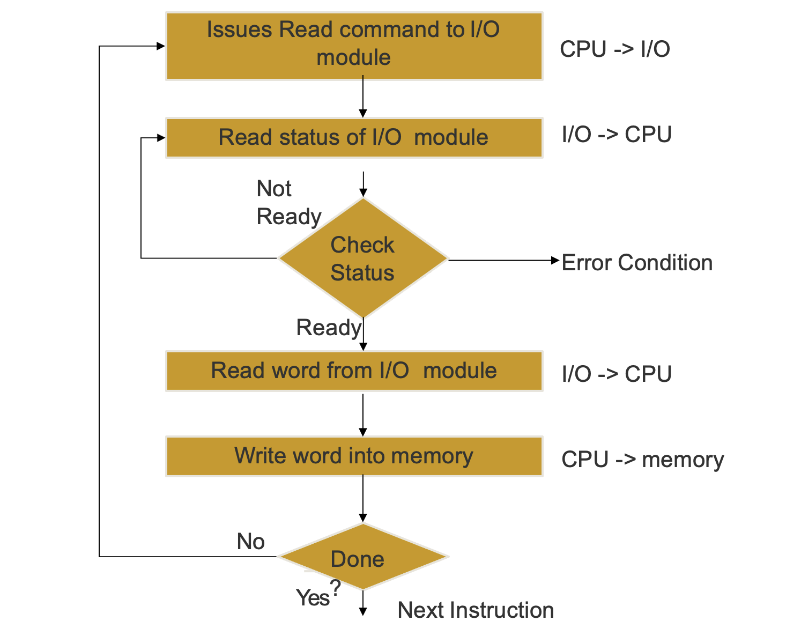
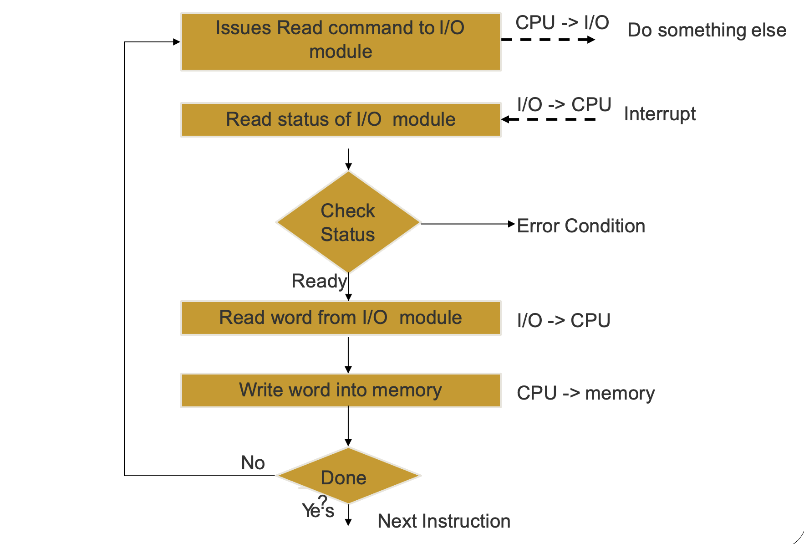
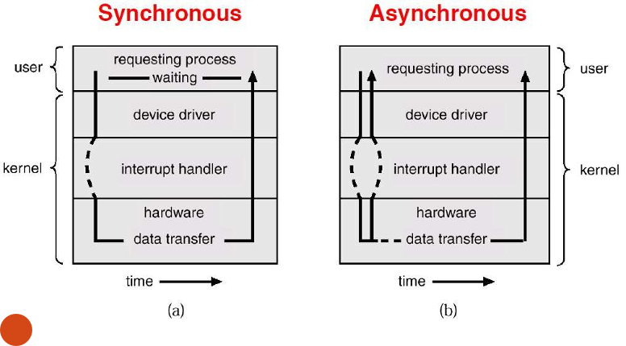

## Synchronous IO Operation

> Some flow of execution, such as a process or a thread is waiting for the operation to complete and once it does complete, then the same process maybe performs some action on it or simply utilises it’s result.

> Blocking of input device until the operation is not performed completely
>
> The processes requiring that specific I/O device need to wait in the Device Queue

* There is no acknowledgment or signal to inform the CPU about the I/O operations
* The OS makes the CPU wait till the I/O complete interrupt is generated

### Synchronous I/O Flow

* CPU Issues *read* command to I/O module
* I/O module inform the CPU about the read status of the I/O device

  * If the device is not ready then a Device Queue entry is made
* I/O module reads word from I/O device to the CPU
* CPU writes this word into the memory
* If another instructions is to be read then the same cycle repeats.

​​

### Polling / Con

> CPU needs to keep track of the status of the I/O device until the operation is being performed

## Asynchronous IO Operation

> Nothing waits for the result to be completed and the completion of the operation itself performs a callback

> The input device is not blocked and can be used simultaneously between different programs and processes

* An acknowledgment bus is used to inform CPU about the operations performed through I/O operations
* The control is immediately returned to the CPU and the program that is being executed

  * During the I/O Operation, If the caller program needs the I/O result to process further then it has to wait or else it can process it’s own operations

​​

### Cons

* Too much context switching
* An interrupt is generated for every byte or word that is copied to or fetched from the input device
  * The reason is that only the CPU can access the memory and therefore needs to store each byte or word by itself

#### [More Detailed Concept](https://stackoverflow.com/a/35012646)

​​

## DMA

DMA stands for Direct Memory Access. **It is a feature of computer systems that allows certain hardware devices to transfer data directly to or from the system memory without involving the CPU (Central Processing Unit).**  DMA provides a more efficient way of transferring data compared to traditional CPU-managed I/O operations.

In a typical I/O operation without DMA, the CPU is involved in the entire data transfer process. The CPU initiates the 1/0 operation, transfers data between the I/0 device and the memory, and performs necessary data processing. This approach can be time-consuming and can tie up the CPU, limiting its availability for other tasks.

DMA alleviates this burden on the CPU by enabling data transfer between the 1/O device and memory without CPU intervention. Here’s how DMA works:

1. Setup: The CPU sets up the DMA controller by specifying the source and destination memory addresses, transfer size, and other necessary parameters.
2. Initiation: Once the DMA controller is configured, the CPU initiates the DMA transfer by issuing a command or triggering a signal. The DMA controller takes over the data transfer process from this point onward.
3. Data Transfer: The DMA controller transfers data directly between the I/O device and memory. It bypasses the CPU and uses a dedicated DMA channel or bus to perform the transfer.
4. Completion: Once the data transfer is complete, the DMA controller interrupts the CPU to notify it of the completion. The CPU can then perform any necessary processing on the transferred data or initiate further actions.

> DMA is used / needed for IO devices to communicate with memory without the involvement of CPU.\
> On the other hand, IO Interrupts are simply interrupts generated by I/O devices to get the CPU attention. This could be for example to inform CPU about requested data so that CPU can put that into the memory in case if DMA is not used.

### Cycle Stealing

> Only once access to memory is possible at a time. Therefore, DMA steals the memory access from the Machine Cycle to be able to use the memory. During this time, the CPU has to wait for memory access. It can slow it down but this still is more efficient then tying up the entire CPU rather than only its access to memory.
