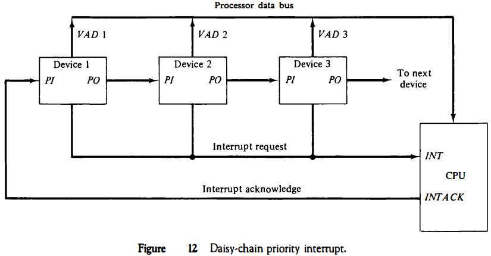

> The daisy-chaining method involves connecting all the devices that can request an interrupt in a serial manner. This configuration is governed by the priority of the devices. The device with the highest priority is placed first followed by the second highest priority device and so on.

​​
