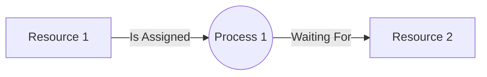
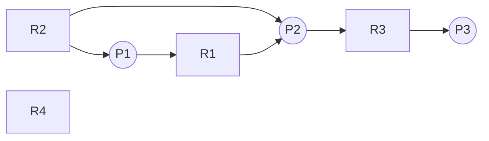
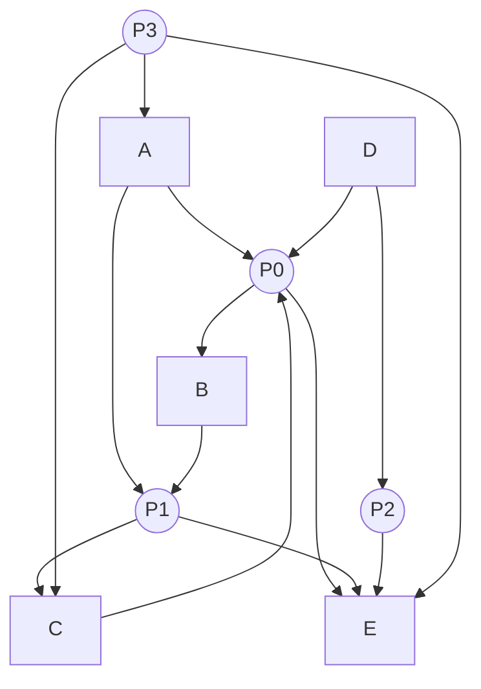

> Deadlocks arise when there exist a hold and wait situation when multiple processes share multiple resources simultaneously

| Process | Hold | Wait |
| ------- | ---- | ---- |
| P1      | 1    | 2    |
| P2      | 2    | 3    |
| P3      | 3    | 4    |
| P4      | 4    | 5    |
| P5      | 5    | 1    |

## Scenario / Example

Consider two processes that require Printer and Scanner but interchangeably. P1 requires printer first and then scanner while P2 requires scanner first and then printer.

At time **T1:** P1 will acquire Printer and P2 will acquire Scanner\
Both of them will then further wait for their respective resource to be free and stuck in a deadlock

## Condition for Deadlock

### Mutual Exclusion

Only one process can use the resource at a single time unit

### Hold and Wait Condition

A thread holding at least one resource is waiting to acquire additional resources held by other threads

### Non-Preemptive Condition

A resource can be released only voluntarily by the thread holding it, after that thread has completed its task

### Circular Wait Condition

There exists a set {T0, T1, …, Tn} of waiting threads such that TO is waiting for a resource that is held by T1, T1 is waiting for a resource that is held by T2, …, Tn-1 is waiting for a resource that is held by Tn, and Tn is waiting for a resource that is held by T0.

We can break this condition to overcome the deadlock in Dining Philosopher Problem

## Resource Allocation Graph

**Allocation Edge:**  Arrow From Resource to Process

**Requesting Edge:**  Arrow  from Process to Resource

**Claim Edge:**  Dotted Arrow from Process to Resource

### Safe Sequences

If we do not follow any of these safe sequences then there will always be a deadlock

**P3 &rarr; P2 &rarr; P1**

## Avoiding Deadlocks

### Single Resource Instance

#### Resource Allocation Graph Algorithm

##### Conditions

1. Cyclic Graph
2. Single Resource Instance for each Resource

> We won’t allow the cyclic graph to be made, we will avoid the requesting edge which converts the graph to a cyclic graph

#### Safe and Unsafe States

If we are able to find a safe sequence given the states of the processes, then we can avoid the deadlock

If free resources are less than the available needs of all of the processes, then this can result in a deadlock

### Multiple Resource Instance

#### Banker’s Algorithm

1. If Need\[i] $\le$ Available then Available = Available + Allocation\[i]

##### Example 1

We can construct safe sequence(s) given the available resource are greater or equal than any of the current process’s need

###### Total Resources Available

| Resource | Total | Available |
| -------- | ----- | --------- |
| A        | 10    | 3         |
| B        | 5     | 3         |
| C        | 7     | 2         |

###### Allocation Matrix

| Process | Allocation A | Allocation B | Allocation C | Max A | Max B | Max C | Need A | Need B | Need C |
| ------- | ------------ | ------------ | ------------ | ----- | ----- | ----- | ------ | ------ | ------ |
| P0      | 0            | 1            | 0            | 7     | 5     | 3     | 7      | 4      | 3      |
| P1      | 2            | 0            | 0            | 3     | 2     | 2     | 1      | 2      | 2      |
| P2      | 3            | 0            | 2            | 9     | 0     | 2     | 6      | 0      | 0      |
| P3      | 2            | 1            | 1            | 2     | 2     | 2     | 0      | 1      | 1      |
| P4      | 0            | 0            | 2            | 4     | 3     | 3     | 4      | 3      | 1      |

##### Example 2 - Draw Resource Allocation Graph from the Matrix

We can construct safe sequence(s) given the available resource are greater or equal than any of the current process’s need

###### Total Resources Available

| Resource | Total |
| -------- | ----- |
| A        | 2     |
| B        | 1     |
| C        | 1     |
| D        | 2     |
| E        | 1     |

###### Allocation Matrix

| Process | Allocation A | Allocation B | Allocation C | Allocation D | Allocation E |
| ------- | ------------ | ------------ | ------------ | ------------ | ------------ |
| P0      | 1            | 0            | 1            | 1            | 0            |
| P1      | 1            | 1            | 0            | 0            | 0            |
| P2      | 0            | 0            | 0            | 1            | 0            |
| P3      | 0            | 0            | 0            | 0            | 0            |

###### Need Matrix

| Process | Need A | Need B | Need C | Need D | Need E |
| ------- | ------ | ------ | ------ | ------ | ------ |
| P0      | 0      | 1      | 0      | 0      | 1      |
| P1      | 0      | 0      | 1      | 0      | 1      |
| P2      | 0      | 0      | 0      | 0      | 1      |
| P3      | 1      | 0      | 1      | 0      | 1      |

