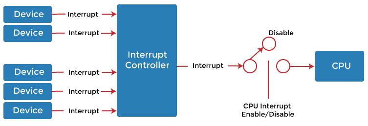

* <https://www.linkedin.com/pulse/comparing-ipc-methods-message-passing-sockets-pipes-lance/>
* 2023-10-29 18:05:04

***

In modern computer systems, multiple processes often need to communicate with each other. This communication between processes is referred to as interprocess communication (IPC). There are different mechanisms for IPC, including shared memory and message passing. This article will discuss the differences between these two mechanisms and their pros and cons.

## **Shared Memory:**

In shared memory, a region of memory is shared by two or more processes. The processes can read and write data to this shared memory region, and the changes made by one process are immediately visible to the other processes. Shared memory is one of the fastest IPC mechanisms because data transfer between processes is done directly in memory without any need for data copying or buffer allocation.

### **Pros of Shared Memory:**

1. **Speed:**  Shared memory is one of the fastest IPC mechanisms. Since data is shared directly in memory, there is no need for data copying or buffer allocation, making it faster than other mechanisms.
2. **Efficiency:**  Shared memory is an efficient mechanism because it reduces overhead. Processes can read and write to the shared memory region directly without the need for an intermediary.
3. **Data Sharing:**  Shared memory is ideal for situations where processes need to share large amounts of data. Since data is stored in a shared memory region, all processes can access it without the need for copying.

### **Cons of Shared Memory:**

1. **Synchronisation:**  Shared memory requires careful synchronisation between processes to avoid data inconsistency. A process must ensure that it is reading the latest data and that no other process is modifying the same data.
2. **Security:**  Shared memory is not secure because it can be accessed by any process that has permission to access it. If one process has malicious intent, it can alter the data, which can cause problems for other processes that rely on that data.
3. **Management:**  Managing shared memory can be challenging, especially when multiple processes are involved. The system must ensure that the shared memory region is allocated and deallocated correctly to prevent memory leaks and other problems.

## **Message Passing:**

In message passing, processes communicate with each other by sending messages. The messages can be sent either synchronously or asynchronously. In synchronous communication, the sending process waits for a response from the receiving process before proceeding, while in asynchronous communication, the sending process does not wait for a response.

### **Pros of Message Passing:**

1. **Security:**  Message passing is more secure than shared memory because messages are sent directly between processes, and only the intended recipient can access the message.
2. **Flexibility:**  Message passing is more flexible than shared memory because it allows processes to communicate even if they are not running on the same machine or operating system.
3. **Error handling:**  In message passing, it is easier to handle errors because each message is processed independently. If an error occurs, it is isolated to that specific message, and it does not affect other messages or the entire system.

### **Cons of Message Passing:**

1. **Overhead:**  Message passing has more overhead than shared memory because messages must be copied and queued for transmission.
2. **Latency:**  In message passing, there is more latency than shared memory because messages must be queued and processed by the operating system.
3. **Complexity:**  Message passing can be more complex than shared memory because it requires explicit coding to send and receive messages, and there is a need to handle message queues and buffering.

**Shared memory and message passing** are two popular mechanisms for interprocess communication. Both mechanisms have their advantages and disadvantages, and the choice of mechanism depends on the specific requirements of the application. Shared memory is faster and more efficient for sharing large amounts of data, while message passing is more secure and flexible. Ultimately, the choice of mechanism depends on the application’s specific needs, and careful consideration should be given to the advantages and disadvantages of each mechanism before making a decision.

In addition to shared memory and message passing, there are other methods for interprocess communication. These include:

1. ## **Pipes**

   1. Pipes are a unidirectional form of IPC. They enable communication between two processes, where one process writes data to the pipe, and the other reads from it.
2. ## **Sockets**

   1. Sockets provide a mechanism for interprocess communication between processes running on different computers, or even different operating systems. Sockets use a client-server architecture, where one process acts as a server and listens for incoming connections, while the other process acts as a client and establishes a connection to the server.
3. ## **Remote Procedure Call (RPC)**

   1. RPC is a mechanism for interprocess communication that allows a process to call a function in another process, as if the function were a local function. RPC provides a higher-level abstraction than shared memory or message passing, as it enables processes to communicate using a procedure call interface.
4. ## **Signals**

   1. Signals are a mechanism for interprocess communication in Unix-based systems. A signal is an interrupt delivered to a process, which can be used to notify the process of an event or to request a specific action.
5. ## Semaphores

   1. Semaphores are a synchronisation mechanism that enables multiple processes to access a shared resource. A semaphore is used to coordinate access to a shared resource, such as a shared memory region, by controlling access to the resource through a counter.

​​

At the CPU level, interprocess communication is typically implemented using hardware interrupts. An interrupt is a signal generated by hardware or software to interrupt the normal execution of a process and transfer control to an interrupt handler routine, which can be used to respond to the interrupt and perform some action.

In modern computer systems, interrupts are used extensively to handle a wide variety of events, such as I/O operations, timer interrupts, and system calls. For example, when a process needs to perform an I/O operation, it sends a request to the operating system, which then issues an I/O command to the device driver. The device driver then waits for the I/O operation to complete and sends an interrupt to the operating system when it is finished. The operating system then sends a signal to the waiting process, indicating that the I/O operation has completed and the process can continue.

Interrupts are a critical component of interprocess communication at the CPU level, as they enable efficient and timely handling of events and provide a way for processes to communicate with each other and with the operating system. Interrupts are implemented in hardware, which makes them very fast and efficient, and they are an essential part of the way modern computer systems handle interprocess communication.

Each of these IPC methods has its own set of advantages and disadvantages, and the choice of method depends on the application’s specific requirements. It is important to evaluate the available options carefully and choose the most appropriate method for the particular scenario.
