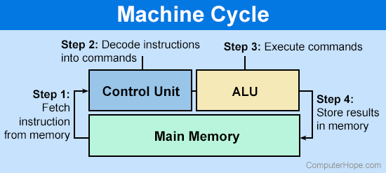

> A machine cycle **consists of the steps that a computer’s processor executes whenever it receives a machine language instruction**. It is the most basic CPU operation, and modern CPUs are able to perform millions of machine cycles per second. The cycle consists of three standard steps: fetch, decode and execute.

​​

The CPU consists of the Control Unit (CU), the Arithmetic and Logic Unit (ALU), and registers (Immediate Access Store).
