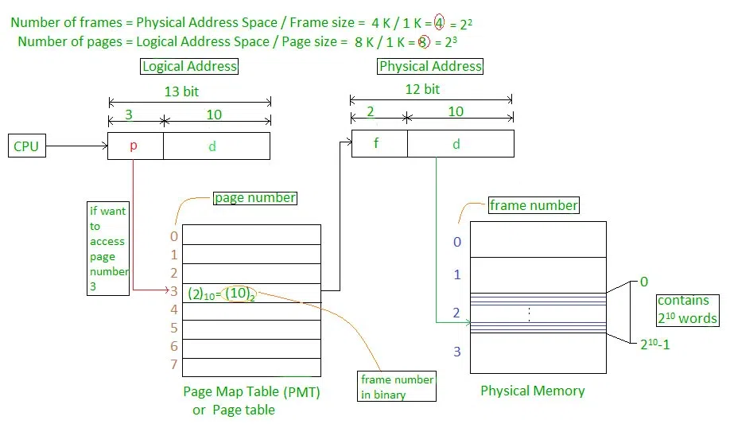

Once needs to understand Program Compilation and the concept of Dynamic Loading to understand

## Hierarchy

* Registers
* Cache

  * Sits between main memory and CPU registers
* Main Memory
* Secondary Memory

## Memory Manager

> Part of OS that manages the memory hierarchy†

* Relocation

  * Assigning new memory block to the process when it is comes back into the Ready State after being suspended
* Protection

  * A process is only allowed to access it’s memory space

    * This is ensured by using the Base and Limit Register. If the requesting memory block address of the program is `>`​ the Base Register and `<`​ the Limit Register, only then is the block allowed to access that memory block
* Sharing
* Physical Memory Organisation

We use Base Register and Limit Register to keep track of the memory partitions

We use Hardware Based Solutions to avoid Critical Section Problems

### Base Register

> Keeps track of the starting address of the partition / block in the memory

### Limit Register

> Keeps track of the size / limit of the partition / block in the memory

## Fixed Sized Partitioning

### Cons

#### Internal Fragmentation

The Fixed Sizes when allocated lesser sized processes, have some space left which might be too small to be used by any other upcoming process

**Solutions**

###### Non-Continuous Memory Allocation

## Variable Sized Partitioning

### Cons

#### External Fragmentation

The size of the partitions might break down too small for larger upcoming programs to fit in

**Solutions**

##### Compaction

> We can move our being used memory blocks to the other part of the memory, this can give us free sized blocks combined on the other part of the memory

##### Coalescing Holes

> We can combine multiple neighbouring holes to create space for the larger program to fit

##### Paging

> ​Each process is divided into the same count of blocks / frames as the memory is divided into

​​

###### Address Allocation Scheme

We have a Page Number of and a Page Offset which tells us where the designated byte (block of the process we require) is stored

**Page Number**:

Page Number tells us the designed divided page assigned to the the byte we seek

**Page Offset**:

Page Offset tells us the starting address of the page in the Page Table

###### Page Table

This table stores the addresses of the pages (from where they start)

###### Paging Model of Logical and Physical Memory

| Adress Type      | Memory Segment | Origin           |
| ---------------- | -------------- | ---------------- |
| Logical Address  | Page           | Process          |
| Physical Address | Frame          | Main Memory      |
| Virtual Address  | Block          | Secondary Memory |

Frame and Block sizes will be same for the Paging Model

**Numerical Example**:

Page Size = Displacements = Offsets = 8 Bytes

No of Pages = 4

Process Size = Page Size x No of Pages = 8 x 4 = 32

| Byte Representation | Page # | D0 | D1 | D2 | D3 | D4 | D5 | D6 | D7 |
| ------------------- | ------ | -- | -- | -- | -- | -- | -- | -- | -- |
| 00                  | 0      | 0  | 1  | 2  | 3  | 4  | 5  | 6  | 7  |
| 01                  | 1      | 8  | 9  | 10 | 11 | 12 | 13 | 14 | 15 |
| 10                  | 2      | 16 | 17 | 18 | 19 | 20 | 21 | 22 | 23 |
| 11                  | 3      | 24 | 25 | 26 | 27 | 28 | 29 | 30 | 31 |

D Represents Displacement

**Logical Address**

| Page Number (Bits) | Displacement Number (Bits) |
| ------------------ | -------------------------- |

**Max Pages in a Process’s Address Space**:

$2^{Page No Bits}$ or $\frac{2^{Process \space Address \space Space \space Size}}{Page Size}$

**Page Table Size**:

$$
Size \space of \space Page \space Table = NP \times PTES
$$

where PTES is the page table entry size, the size in bits which store the frame number out of total frames in the Main Memory

PTES can be calculated by dividing the bits of Frame Number by 8 (Converting it into Bytes)

**Physical Address**

| Frame Number (Bits) | Displacement Number (Bits) |
| ------------------- | -------------------------- |

The displacement number is same as in the case of Logical Address

Frame Size = 8 Bytes

No of Frames = 8

Size of Main Memory = 8 x 8 = 64 Bytes

| Frame # | D0 | D1 | D2 | D3 | D4 | D5 | D6 | D7 |
| ------- | -- | -- | -- | -- | -- | -- | -- | -- |
| 0       | 0  | 1  | 2  | 3  | 4  | 5  | 6  | 7  |
| 1       | 8  | 9  | 10 | 11 | 12 | 13 | 14 | 15 |
| 2       | 16 | 17 | 18 | 19 | 20 | 21 | 22 | 23 |
| 3       | 24 | 25 | 26 | 27 | 28 | 29 | 30 | 31 |

## Roles of Bitmaps

> Memory is divided into allocation units and each unit is expressed with a bit
>
> If a bit is `1`​ it represents that the space is occupied while a `0`​ tell that this is a hole

* Size of allocation unit is important

  * Smaller Bitmap Unit

    * Larger bitmap required
  * Larger Bitmap Unit

    * Smaller bitmap required

Allocation units can be in:

* Words
* Several Kilobytes

## Roles of Linked Lists

> Each Node represents a process and a hole. In this way we can find holes within our Linked List

A Node not only stores the the state of the block (process or a hole), it also tells us the:

* Size of the Block
* Starting Address
* Ending Address

## Resources

[Paging in Operating System | Geeks for Geek](https://www.geeksforgeeks.org/paging-in-operating-system/)
