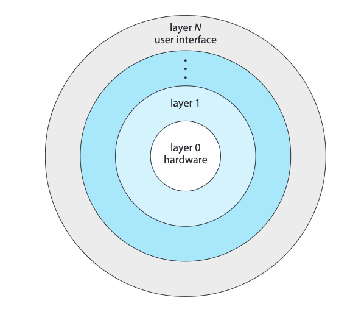

## Monolithic

[A Linux Monolithic Architecture](assets/Abraham-Silberschatz-Operating-System-Concepts-10th-2018-20230917173659-aljli44.pdf#page=113)\

[The simplest structure for organising an operating system is no structure at all. That is, place all of the functionality of the kernel into a single, static binary file that runs in a single address space. This approach—known as a monolithic structure—is a common technique for designing operating systems.](assets/Abraham-Silberschatz-Operating-System-Concepts-10th-2018-20230917173659-aljli44.pdf#page=112)

In a monolithic operating system structure, the entire operating system is implemented as a single large program or kernel. It consists of various modules and functions tightly integrated together without clear separation. The operating system provides all services, including process management, memory management, file systems, device drivers, and more, within a single unified structure. The need for this structure is often driven by simplicity and performance, as direct function calls and shared memory access can be efficient. However, it lacks modularity and can be challenging to maintain and extend.

[Monolithic kernels do have a distinct performance advantage, however: there is very little overhead in the system-call interface, and communication within the kernel is fast.](assets/Abraham-Silberschatz-Operating-System-Concepts-10th-2018-20230917173659-aljli44.pdf#page=112)

- Entire O.S. is placed in kernel space
- All O.S. code runs in privileged mode
- Higher performance but higher risk for system crash

## Layered

[A Layered Architecture](assets/Abraham-Silberschatz-Operating-System-Concepts-10th-2018-20230917173659-aljli44.pdf#page=114)\
​​

In a layered operating system structure, the operating system is divided into layers, where each layer provides a set of related services. Each layer builds upon the layer below it, and higher layers depend on lower layers for functionality. This structure allows for modular design, separation of concerns, and ease of maintenance. Each layer provides a well-defined interface for the layer above, hiding the implementation details. For example, one layer may handle process management, another layer may handle file systems, and so on. The need for a layered structure arises from the desire for modularity, abstraction, and easier debugging and development of operating systems.

[The monolithic approach is often known as a tightly coupled system because changes to one part of the system can have wide-ranging effects on other parts. Alternatively, we could design a loosely coupled system. Such a system is divided into separate, smaller components that have specific and limited functionality. All these components together comprise the kernel.](assets/Abraham-Silberschatz-Operating-System-Concepts-10th-2018-20230917173659-aljli44.pdf#page=113)

## Microkernel

A microkernel structure aims to minimise the kernel's size and complexity by moving most of the operating system services out of the kernel and into user-space processes. The microkernel provides only essential services such as process scheduling, inter-process communication, and basic memory management. Other services, such as device drivers and file systems, are implemented as separate user-space processes called servers. The microkernel provides a communication mechanism for these servers to interact with each other and with user processes. The main advantage of a microkernel structure is increased flexibility, as it allows for easier customisation, addition, and removal of services without modifying the kernel. However, the performance overhead of inter-process communication can be a drawback.

[Perhaps the best-known illustration of a microkernel operating system is Darwin, the kernel component of the macOS and iOS operating systems. Darwin, in fact, consists of two kernels, one of which is the Mach microkernel.](assets/Abraham-Silberschatz-Operating-System-Concepts-10th-2018-20230917173659-aljli44.pdf#page=115)

## Virtual Machines

A virtual machine (VM) structure involves running multiple instances of operating systems, called virtual machines, on a single physical machine. Each virtual machine acts as an independent and isolated environment, running its own operating system instance and applications. The virtualisation layer, often called the hypervisor, manages and allocates the physical resources to the virtual machines. The need for virtual machines arises from the desire to consolidate hardware resources, improve resource utilisation, and isolate different environments. Virtual machines enable running multiple operating systems and applications on the same hardware, allowing for efficient server consolidation, software testing, and sandboxed execution of potentially insecure or incompatible software.
