[CPU-Scheduling-and-Algorithm - Handouts.pdf](assets/CPU-Scheduling-and-Algorithm-%20handouts-20230930085621-i0kut1y.pdf)

##### Burst Time

Process Execution Time

##### Turn Around Time

Completion Time - Arrival Time

##### Waiting Time

Turn Around Time - Bust Time

##### Average Waiting Time

$\sum$ Waiting Time / Number of Processes

##### Priority Numbers

Based on these numbers, the algorithm prioritises processes

*The lowest the number the higher the priority*

*The highest the number the lowest the priority*

## Types

### Non-Preemptive

> These algorithms have no control over the preemption of the process, thus the next process can only come when the previous one is done completing its bust time

#### SJF - Shortest Job First

```mermaid
gantt
    title SFJ Gantt Chart
    dateFormat X
    axisformat %M:%S
    section P1
        7/7: 0, 7
    section P2
	4/4: 8, 12
    section P3
        1/1: 7,8
    section P4
	4/4: 12, 16
```

| Processes | Arrival Time | Burst Time | Turn Around Time | Waiting Time |
| --------- | ------------ | ---------- | ---------------- | ------------ |
| P1        | 0            | 7          | 7                | 0            |
| P2        | 2            | 4          | 10               | 6            |
| P3        | 4            | 1          | 4                | 3            |
| P4        | 5            | 4          | 11               | 7            |

#### FCF - First Come First

```mermaid
gantt
    title FCF Gantt Chart
    dateFormat X
    axisformat %M:%S
    section P1
        24: 0, 24
    section P2
        3: 24, 27
    section P3
        3: 27, 30
    section P4
       5: 30, 35
```

| Processes | Burst Time | Turn Around Time | Waiting Time |
| --------- | ---------- | ---------------- | ------------ |
| P1        | 24         | 24               | 0            |
| P2        | 3          | 27               | 24           |
| P3        | 3          | 30               | 27           |
| P4        | 5          | 35               | 30           |

### Preemptive

#### SRTF - Shortest Remaining Time First

* Preemptive version of SJF - Shortest Job First
* Preempt the CPU based on the shortest time required by a process

```mermaid
gantt
    title SRTF Gantt Chart
    dateFormat X
    axisformat %M:%S
    section P1
        2/7: 0, 2
	7/7: 11, 16
    section P2
        2/4: 2, 4
	4/4: 5, 7
    section P3
        1/1: 4, 5
    section P4
	4/4: 7, 11
```

| Processes | Arrival Time | Burst Time | Turn Around Time | Waiting Time |
| --------- | ------------ | ---------- | ---------------- | ------------ |
| P1        | 0            | 7          | 16               | 9            |
| P2        | 2            | 4          | 5                | 1            |
| P3        | 4            | 1          | 1                | 0            |
| P4        | 5            | 4          | 6                | 2            |

#### RR - Round Robin

* Provide equal Time Quantum to all processes
* A queue is maintained where processes waiting are put one after another

  * The next processes is picked from the top of the queue

##### Time Quantum

The CPU time which is to be assigned to each processes

##### Example Time Quantum = 2

```mermaid
gantt
    title RR Gantt Chart
    dateFormat X
    axisformat %M:%S
    section P1
        2/5: 0, 2
	4/5: 6, 8
	5/5: 11, 12
    section P2
	2/4: 2, 4
	4/4: 9, 11
    section P3
        2/2: 4,6
    section P4
	1/1: 8,9
```

| Process | Arrival Time | Burst Time | Turn Around Time | Waiting Time |
| ------- | ------------ | ---------- | ---------------- | ------------ |
| P1      | 0            | 5          | 2                | 7            |
| P2      | 1            | 4          | 10               | 6            |
| P3      | 2            | 2          | 4                | 2            |
| P4      | 3            | 1          | 6                | 5            |

##### Example Time Quantum = 10

```mermaid
gantt
    title RR Gantt Chart
    dateFormat X
    axisformat %M:%S
    section P1
	10/20: 0, 10
	20/20: 10, 20
    section P2
	10/25: 25, 35
	20/25: 45, 55
	25/25: 65, 70
    section P3
        10/25: 35,45
	20/25: 55, 65
	25/25: 80, 85
    section P4
	10/15: 70, 80
	15/15: 85, 90
    section P5
	10/10: 100, 110
    section P6
	10/10: 110, 120
```

| Process | Arrival Time | Burst Time | Turn Around Time | Waiting Time |
| ------- | ------------ | ---------- | ---------------- | ------------ |
| P1      | 0            | 20         | 20               | 0            |
| P2      | 25           | 25         | 45               | 20           |
| P3      | 30           | 25         | 55               | 30           |
| P4      | 60           | 15         | 30               | 15           |
| P5      | 100          | 10         | 10               | 0            |
| P6      | 105          | 10         | 15               | 5            |

#### Multi Level Queue Scheduling

* Multiple Queues are maintained with each Queue having a Priority
* Each Queue may represent a process, such as System Processes, Interactive Processes, Student Processes etc.
* Lower priority queues will only be executed until the higher priority queues are not empty
* If lower priority queue process is executing and within that time a higher priority queue process arrives then the lower priority queue process is preempted and higher priority process is executed first.

```mermaid
gantt
    title Two Queues with Q1 (RR Time Quantum 2) & Q2 (FCFS)
    dateFormat X
    axisformat %M:%S
    section P1
        2/4: 0, 2
	4/4: 4, 6
    section P2
        2/3: 2, 4
	3/3: 6, 7
    section P4
       2/5: 10, 12
       4/5: 12, 14
       5/5: 14, 15
    section P3
        3/8: 7, 10
	8/8: 15, 20
```

| Processes | Arrival Time | Burst Time | Queue Number |
| --------- | ------------ | ---------- | ------------ |
| P1        | 0            | 4          | 1            |
| P2        | 0            | 3          | 1            |
| P4        | 10           | 5          | 1            |
| P3        | 0            | 8          | 2            |

‍

#### Multi Level Feedback Queue

* Initially all processes belong to the first queue
* Shift the processes to below queues if they are not bursted within the current queue
* Last queue always have FCFS

| Processes | Burst Time |
| --------- | ---------- |
| P1        | 30         |
| P2        | 20         |
| P3        | 10         |

```mermaid
gantt
    title Multil Level Feedback Queue - RR TQ = 1 (Queue 1) | RR TQ = 2 (Queue) 2 & FCFS
    dateFormat X
    axisformat %M:%S
    section P1
        (Queue 1) 1/30: 0, 1
	(Queue 2) 3/30: 3, 5
	(Queue 3) 30/30: 9, 35
    section P2
	(Queue 1) 1/20: 1, 2
	(Queue 2) 3/20: 5, 7
	(Queue 3) 20/20: 35, 51
    section P3
        (Queue 1) 1/10: 2, 3
	(Queue 2) 3/10: 7, 9
	(Queue 3) 10/10: 51, 57
```

