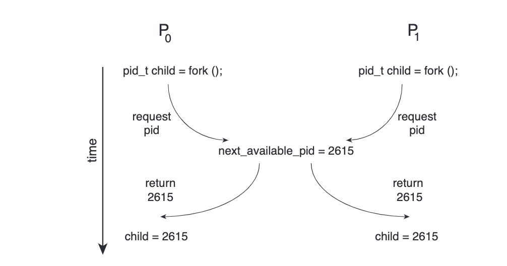
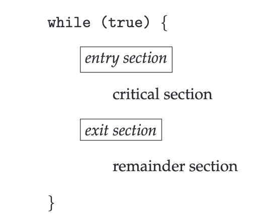

> When we have multiple processes running at the same time (i.e. concurrently) we know that we must protect them from one another but also at the same time we also might want multiple threads to work on a same problem and thus synchronisation is required.

## Race Condition

> Conflicts that can arose as process / threads share same memory space / variables

[A situation like this, where several processes access and manipulate the same data concurrently and the outcome of the execution depends on the particular order in which the access takes place, is called a race condition](assets/Abraham-Silberschatz-Operating-System-Concepts-10th-2018-20230917173659-aljli44.pdf#page=334)

We need to avoid this race condition

[Race condition when assigning a pid.](assets/Abraham-Silberschatz-Operating-System-Concepts-10th-2018-20230917173659-aljli44.pdf#page=336)\
​​

### Critical Section

> When there is shared memory but the mode is in non-shareable
>
> That piece of code where multiple processes / threads access the same shared data

[Consider a system consisting of n processes{P0 , P1 , …, P n−1 }. Each process has a segment of code, called a critical section in which the process may be accessing — and updating — data that is shared with at least one other process. The important feature of the system is that, when one process is executing in its critical section, no other process is allowed to execute in its critical section. That is, no two processes are executing in their critical sections at the same time.](assets/Abraham-Silberschatz-Operating-System-Concepts-10th-2018-20230917173659-aljli44.pdf#page=335)

[General structure of a typical process](assets/Abraham-Silberschatz-Operating-System-Concepts-10th-2018-20230917173659-aljli44.pdf#page=335)\
​​

[Each process must request permission to enter its critical section. The section of code implementing this request is the entry section. The critical section may be followed by an exit section. The remaining code is the remainder section](assets/Abraham-Silberschatz-Operating-System-Concepts-10th-2018-20230917173659-aljli44.pdf#page=335)

### Solutions to Race Condition / Critical Section

#### Required Criteria to Fulfil

##### Mutual Exclusion

[If process Pi is executing in its critical section, then no other processes can be executing in their critical sections](assets/Abraham-Silberschatz-Operating-System-Concepts-10th-2018-20230917173659-aljli44.pdf#page=335)

if one process is executing its critical section then no other co-operative process should be allowed to execute its dependent critical section at same time.

​​

##### Progress

[If no process is executing in its critical section and some processes wish to enter their critical sections, then only those processes that are not executing in their remainder sections can participate in deciding which will enter its critical section next, and this selection cannot be postponed indefinitely.](assets/Abraham-Silberschatz-Operating-System-Concepts-10th-2018-20230917173659-aljli44.pdf#page=335)

* If only one process wants to enter, it should be able to.
* If two or more want to enter, one of them should succeed.
* No process in its remainder section can participate in this decision
* Selection should not be postponed indefinitely
* No deadlock

If both process can run individually one after other in any order (firstly P\_0 then P\_1 or firstly P\_1 then P\_0) without any preemption in between then we can say progress is there.

##### Bounded Waiting

[There exists a bound, or limit, on the number of times that other processes are allowed to enter their critical sections after a process has made a request to enter its critical section and before that request is granted.](assets/Abraham-Silberschatz-Operating-System-Concepts-10th-2018-20230917173659-aljli44.pdf#page=336)

if one process(X) is executing its critical section and other cooperative process(Y) is waiting to go in critical section then when X is completed and if again X wants to go in critical section it should be not be allowed as Y is waiting for Critical section for a long time so Y must get chance before X.

#### Software Solutions

##### Lock Variables

* We can set a variable as our `FLAG`​​ to enter critical section or not
* A Process which enters critical section turns the FLAG to false / true and hence the other processes wait for that flag in order to access the critical section

```C
flag = NULL
```

```C
while(true){
	// Entry Section
	while(flag == 1);
	flag = 1

	// Critical Section

	// Exit Section
	flag = 0

	// Remainder Section
}
```

```C
while(true){
	// Entry Section
	while(flag == 1);
	flag = 1

	// Critical Section

	// Exit Section
	flag = 0;

	// Remainder Section
}
```

* However, Mutual Exclusion might not be followed

  * What if both processes check the flag condition at the same time and find it true?

##### Strict Alteration with One Variable

* Single Variable as a turn

```C
turn = 0
```

```C
while(true){
	// Entry Section
	while(turn != 0);

	// Critical Section

	// Exit Section
	turn = 1;

	// Remainder Section
}
```

```C
while(true){
	// Entry Section
	while(turn != 1);

	// Critical Section

	// Exit Section
	turn = 0;

	// Remainder Section
}
```

* It satisfies Mutual Exclusion but Progress is not maintained

  * Process P2 cannot run before P1 as the value of `turn = 0`​ and thus it will busy wait

##### Strict Alteration with Array

* An Array of Flags Determining Need to Access

```C
flag[2] = {0, 0}
```

```C
while(true){
	// Entry Section
	flag[0] = 1;
	while(flag[1] == 1);

	// Critical Section

	// Exit Section
	flag[0] = 0;

	// Remainder Section
}
```

```C
while(true){
	// Entry Section
	flag[1] = 1;
	while(flag[0] == 1);

	// Critical Section

	// Exit Section
	flag[1] = 0;

	// Remainder Section
}
```

* Satisfies all conditions
* Deadlock can occur if both program first execute their first conditions and the wait for each other

##### Peterson’s Solution

* We utilise both the turn and flag array of the Strict Alteration

```c
turn = 1
interested[2] = [0, 0]
```

```C
while(true){
	// Entry Section
	interested[0] = TRUE;
	turn = 1;
	while(interested[1] == true && turn == 1);

	// Critical Section

	// Exit Section
	interested[0] = FALSE;
}
```

```C
while(true){
	// Entry Section
	interested[1] = TRUE;
	turn = 0;
	while(interested[0] == true && turn == 0);

	// Critical Section

	// Exit Section
	interested[1] = FALSE;
}
```

* Peterson solution isn’t practical because it can not solve critical section problem for more than two processes at the same time

#### Hardware Solutions

##### Test and Set

We can build a function that provides atomic behaviour for our critical section

```C
bool TestAndSet(bool *target){
	bool returnVal = *target;
	*target = true;
	return returnVal;
}
```

```C
bool lock = false
```

```C
while(true){
	// Entry Section
	while(TestAndSet(&lock));

	// Critical Section

	// Exit Section
	lock = false;
}
```

```C
while(true){
	// Entry Section
	while(TestAndSet(&lock));

	// Critical Section

	// Exit Section
	lock = false;
}
```

* Mutual Exclusion is there
* Progress is there
* Bounded Waiting is not there

  * What if the same process keeps going to the critical section in the while loop while there is no context switching in a scenario?

##### Fetch and Add

```C
int FAA(int &s, int a){
	int temp = s;
	s = s + a;
	return temp;
}
```

```C
s = 0; turn = 0;
```

```C
while(true){
	// Entry Section
	me = FAA(s, 1);
	while(turn < me);

	// Critical Section

	// Exit Section
	FAA(turn, 1);
}
```

* Mutual Exclusion satisfied
* Progress is achieved
* Bounded Wait is also there

##### Semaphore

[LittleBookOfSemaphores.pdf](assets/LittleBookOfSemaphores-20231114082910-5f7a4jr.pdf)

[A semaphore S is an integer variable that, apart from initialisation, is accessed only through two standard atomic operations: wait() and signal().](assets/Abraham-Silberschatz-Operating-System-Concepts-10th-2018-20230917173659-aljli44.pdf#page=347)

```C
signal(S){
	// Turn On
	S++;
}
```

```C
wait(S){
	while(S <= 0);
	S--; // Turn Off
}
```

* N Process Solution
* Consists of a single Variable that manages the waiting or access to the critical section

Initialised with 1 or N which allows the count of processes that can access the critical section

Consists of Wait Function which makes the process wait according to the value of S

Upon Exiting the value of S is incremented

* Satisfies Mutual Exclusion
* Satisfies Progress
* Does not satisfy Bounded Wait

###### Mutex

> Mutual Exclusion Variable
>
> The semaphore variable that can be owned by one process at a time

###### Applications

* Critical Section Problem
* Deciding Order of Execution

  * We can utilise this by using multiple Semaphore Mutexes
* Managing multiple resources

  * Such as printers that would run simultaneously
* Classical Problems

  * Bounded Buffer Problem

    * Producer - Consumer Synchronisation can be achieved
  * Reader-writers Problem

    * We can restrict writing when something is being read
  * Dining Philosopher Problem
