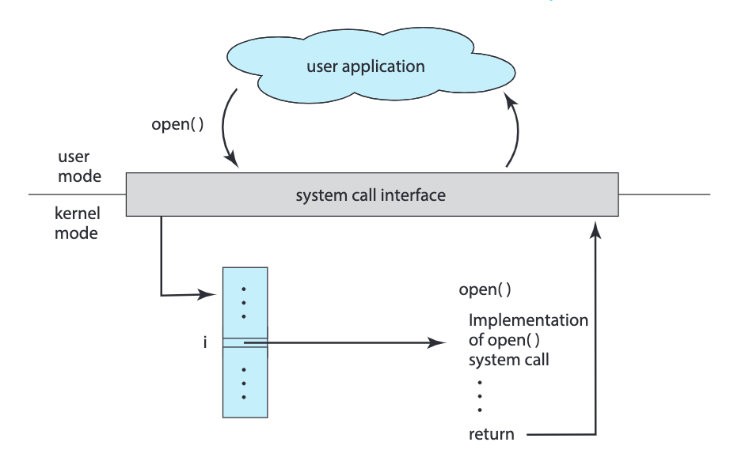

> We can use system calls to view, create and modify the system processes

[System calls provide the interface between a process and the OS. These calls are generally available as assembly language instructions. The system call interface layer contains entry point in the kernel code; because all system resources are managed by the kernel any user or application request that involves access to any system resource must be handled by the kernel code, but user process must not be given open access to the kernel code for security reasons. So that user processes can invoke the execution of kernel code, several openings into the kernel code, also called system calls, are provided. System calls](assets/Operating%20Systems%20-%20CS604%20Handouts-20230917173807-mvuhx4l.pdf#page=15)

[How do System Calls Work?](assets/Abraham-Silberschatz-Operating-System-Concepts-10th-2018-20230917173659-aljli44.pdf#page=95)\
​​

[System calls can be divided into six major categories: (1) process control,(2) file management, (3) device management, (4) information maintenance,(5) communications, and (6) protection.](assets/Abraham-Silberschatz-Operating-System-Concepts-10th-2018-20230917173659-aljli44.pdf#page=130)

[Pictorial view of the steps needed for execution of a system call](assets/Operating%20Systems%20-%20CS604%20Handouts-20230917173807-mvuhx4l.pdf#page=16)\
​​

[The kernel uses call number to index a kernel table (the dispatch table) which contains pointers to service routines for all system calls](assets/Operating%20Systems%20-%20CS604%20Handouts-20230917173807-mvuhx4l.pdf#page=16)

## Fork

## Exec
