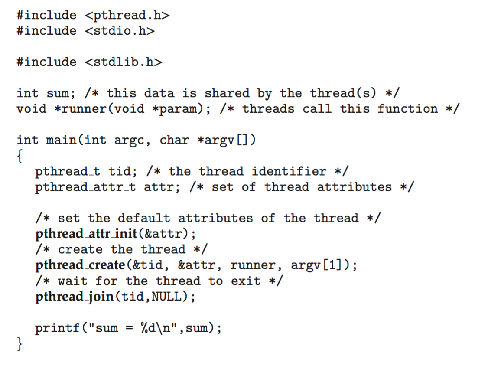

> A single process can have multiple code segments which are called <span class="text-highlight">threads</span> that run concurrently within the context of that process.
>
> Multiple tasks within a process can be implemented by separate threads
>
> Processes that utilise threads are called Multithreaded Processes

- Every thread belongs to a Process
- A process initially has only one thread called the main thread

Threads Share:

- Code
- Data / Heap
- Files

Each Thread Holds its Unique:

- Program Counter Value
- Registers
- Stack

| Process               | Thread                                |
| --------------------- | ------------------------------------- |
| Heavy                 | Light                                 |
| Interaction with OS   | No Interaction with the OS            |
| Operate Independently | Sharing of data between other threads |
| Have a PCB            | Have a TCB                            |

## TCB

> Thread Control Block
>
> Stores the data related to each thread
>
> Stored within the program’s memory

## Types

​​

### User Threads

> Management is done by the User-Level threads library

Primary Threads Library:

- POSIX Pthreads
- Windows Threads
- Java Threads

### Kernel Threads

> System Level Threads, which belong to the System Processes, acting on the Kernel

Virtually all general purpose operating systems have these

## Correlation with State Process Model

> If one of the thread of a process requires an I/O operation, according to the Process Model used in the CPU, that entire process needs to be blocked and hence all of its other threads will also be blocked
>
> If a process or even if one of its thread requires an I/O operation, the whole process is blocked

Threads share data and thus to control synchronisation, all other threads should be blocked when even one of the thread is communicating with I/O

### Exception

- Kernel Threads

  - They are working within the Kernel Area and thus Kernel / OS are familiar that which thread requires I/O and how the synchronisation should be dealt

| User Threads                       | Kernel Threads                             |
| ---------------------------------- | ------------------------------------------ |
| Lower Overhead of Switching        | Higher Overhead of Switching               |
| Implementation by a Thread Library | Implementation directly by the OS / Kernel |

## Creation / Implementation

```C
pthread_create(pthread_t*, NULL, void*, void*)
pthread_t - Pointer of Thread ID
return -1 = Error
return 0 = Successful Creation
```

| Commands       | Description                           |
| -------------- | ------------------------------------- |
| pthread_create | Creation of a thread                  |
| pthread_self   | Get the current thread id             |
| pthread_join   | Wait for a thread                     |
| pthread_exit   | Exit a thread without exiting process |

### Example

Consider we have the following function:

​​

Following is the main function / process:

​​

## Multithreading

Multithreading allows the application to divide its task into individual threads. In multi-threads, the same process or task can be done by the number of threads, or we can say that there is more than one thread to perform the task in multithreading. With the use of multithreading, multitasking can be achieved

### Multithreading Models

In an [operating system](https://www.javatpoint.com/os-tutorial), threads are divided into the user-level thread and the Kernel-level thread. User-level threads handled independent form above the kernel and thereby managed without any kernel support. On the opposite hand, the operating system directly manages the kernel-level threads. Nevertheless, there must be a form of relationship between user-level and kernel-level threads.

> [!tip]
> Also look into **thread synchronisation**.

---

## Misc

### What happens when you call a ​`fork()` in a thread?

The `fork()`​ system call creates a new process by duplicating the calling process. However, when called within a multithreaded program, the behaviour can be complex and platform-dependent. In general, <span class="text-highlight">the new process will have a single thread, a copy of the calling thread, and any other threads in the calling process are not duplicated</span>. The child process will start its execution from the point of the `fork()`​ call.

[If we call fork(2) in a multi-threaded environment the thread doing the call is now the main-thread in the new process and all the other threads, which ran in the parent process, are dead. And everything they did was left exactly as it was just before the call to fork(2).](<https://thorstenball.com/blog/2014/10/13/why-threads-cant-fork/#:~:text=If%20we%20call%20fork(2)%20in%20a%20multi%2Dthreaded%20environment%20the%20thread%20doing%20the%20call%20is%20now%20the%20main%2Dthread%20in%20the%20new%20process%20and%20all%20the%20other%20threads%2C%20which%20ran%20in%20the%20parent%20process%2C%20are%20dead.%20And%20everything%20they%20did%20was%20left%20exactly%20as%20it%20was%20just%20before%20the%20call%20to%20fork(2).>)

#### Example

```c
func(){
	pid_t pid;
	for(int i=0; i<2; i++)
		pid = fork();
	printf("Bye!");
	exit(NULL);
}

pid_t t1;
pthread_create(&t1, NULL, func, NULL);
pthread_join(&t1, NULL);
fork()
printf("Hello!");
```

### What happens if process returns without waiting for its threads?

If the thread has done some execution while the process was active then that will count however, as soon as the parent process terminates, <span class="text-highlight">all of its threads are discarded</span>.

### What happens when a thread calls an ​​`exit()` function?

When a thread calls the `exit()`​ function, it <span class="text-highlight">terminates not only the calling thread but also the entire process</span>. The `exit()`​ function is typically used to gracefully terminate the program, and it causes the termination of all threads within the process.

### Can a function that is a part of the program be called from a thread?

Yes, a function that is part of the program can be called from a thread. Threads in a program share the same address space, and they <span class="text-highlight">can execute any function or code that is accessible</span> within that address space. However, caution is needed to ensure proper synchronisation mechanisms (e.g., mutexes) are in place to avoid data corruption in a multi-threaded environment.

### What happens when you call ​`pthread_exit()`​ in the main thread?

If `pthread_exit()`​ is called in the main thread, <span class="text-highlight">it will terminate just the main thread, not the entire process. Other threads, if any, will continue to execute</span>. It’s a way to exit the main thread while leaving other threads running. The resources associated with the main thread will be released once it exits.

### Why do we fork when we can use threads?

Forking and using threads serve different purposes. Forking creates a new process, which is useful for parallelism and creating independent processes. Each process has its own address space and runs independently of the others. On the other hand, threads share the same address space, making them suitable for tasks that can benefit from shared data and communication between threads. The choice between forking and using threads depends on the specific requirements of the task and the desired concurrency model. In some cases, a combination of both processes and threads might be appropriate.
