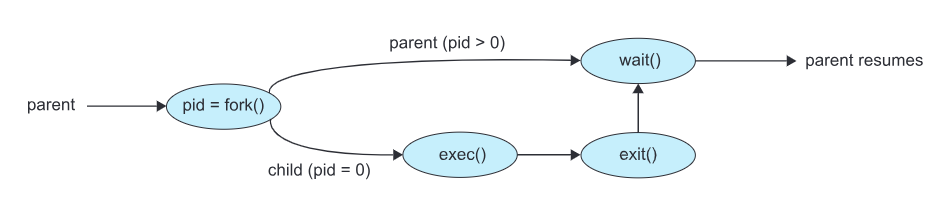

> POSIX System call to make the parent process wait for all of its child processes to complete / run some status using the Exit() system call

[Demonstration of wait() System Call](assets/Abraham-Silberschatz-Operating-System-Concepts-10th-2018-20230917173659-aljli44.pdf#page=157)\
​​

* If any process has more than one child processes, then after calling wait(), parent process has to be in wait state if no child terminates
* If only one child process is terminated, then wait() returns process ID of the terminated child process.
* If more than one child processes are terminated than wait() reap any ***arbitrarily child*** and return a process ID of that child process
* When wait() returns they also define \*\*exit status \*\* via pointer, If pointer is not **NULL**
* If any process has no child process then wait() returns `-1`​ immediately.
